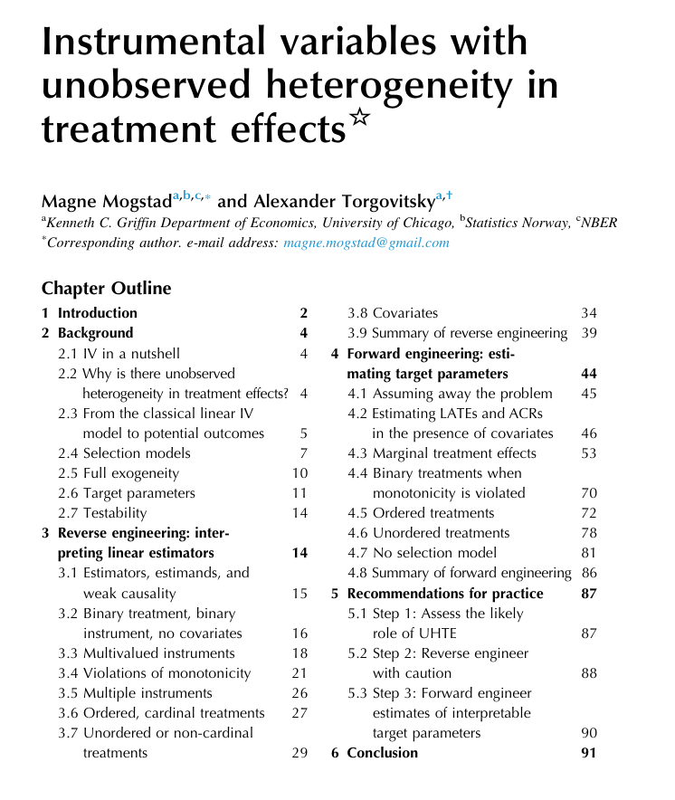
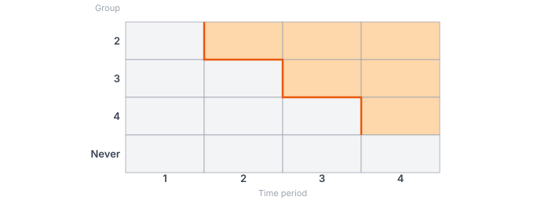

## Overview of the Course

```{r echo=FALSE}
library(revealEquations)
```

$\newcommand{\E}{\mathbb{E}}
\newcommand{\E}{\mathbb{E}}
\newcommand{\var}{\mathrm{var}}
\newcommand{\cov}{\mathrm{cov}}
\newcommand{\Var}{\mathrm{var}}
\newcommand{\Cov}{\mathrm{cov}}
\newcommand{\Corr}{\mathrm{corr}}
\newcommand{\corr}{\mathrm{corr}}
\newcommand{\L}{\mathrm{L}}
\renewcommand{\P}{\mathrm{P}}
\newcommand{\ACR}{\mathrm{ACR}}
\newcommand{\ATT}{\mathrm{ATT}}
\newcommand{\ACRT}{\mathrm{ACRT}}
\newcommand{\T}{\mathrm{T}}
\newcommand{\independent}{{\perp\!\!\!\perp}}
\newcommand{\indicator}[1]{ \mathbf{1}\{#1\} }$

0. Introduction to difference-in-differences

1. Difference-in-differences with a continuous treatment

2. Assessing strong parallel trends via close comparison groups

3. Shift-share designs

## Materials for the Course

[Available on my website:]{.alert} [https://bcallaway11.github.io/ull](https://bcallaway11.github.io/ull)

* All slides
* Links to main reference papers for each topic

# Introduction to Difference-in-Differences with a Binary Treatment {visibility="uncounted"}

1. Panel Data Causal Inference: Challenges and Opportunities

2. DiD with Two Periods

3. Staggered Treatment Adoption
   * Issues with Traditional Regression Approaches
   * New Approaches

4. Empirical Application

<!-- 4. Application + Code -->


<!--
title: "Modern Approaches to Difference-in-Differences"
subtitle: "Session 1: Introduction to Difference-in-Differences"-->
<!--## Plan for the Session-->

<!--
1. Introduction to Difference-in-Differences

    1. DiD Basics in 2 Period Case

    2. Staggered Treatment Adoption
       * Issues with Traditional Regression Approaches
       * New Approaches

    3. Application/Code for Minimum Wage Policy

2. Including Covariates in the Parallel Trends Assumption

3. Common Extensions for Empirical Work

4. Dealing with More Complicated Treatment Regimes

5. Alternative Identification Strategies
-->

## Main References for This Session

* @baker-callaway-cunningham-goodman-santanna-2026, *Journal of Economic Literature*
* @callaway-2023, *Handbook of Labor, Human Resources, and Population Economics*

## Additional Resources {visibility="uncounted"}

<span class="alert">Advanced Materials: </span> [https://github.com/bcallaway11/bank-of-portugal](https://github.com/bcallaway11/bank-of-portugal)

  * Relaxing the parallel trends assumption by including covariates

  * Common issues in empirical work

  * Dealing with more complicated treatment regimes

  * Alternative identification strategies (e.g., conditioning on lagged outcome, change-in-changes, others)

## Running Example

[Running Example:]{.alert} Causal effect of a state-level minimum wage increase on employment

* Widely studied using DiD identification strategies (@card-krueger-1994, many others)
* [For today:]{.alert-blue} very simplified version with
  1. No changes in federal minimum wage
  2. "Binarized" state minimum wages (i.e., state minimum wage is either above the federal minimum wage or not)

# [Part 1]{.alert-blue}<br><br> Panel Data Causal Inference: Challenges and Opportunities {visibility="uncounted"}

## Research Design

<!--[Research Design:]{.alert-blue} The setting that the researcher will use to estimate causal effects.-->

<span class="alert">Pre-Post Design:</span>

1. Two periods of panel data
2. No units treated in first period
3. Some units become treated in second period while other units remain untreated

<span class="alert-blue">Staggered Adoption Design:</span>

1. Multiple periods of panel data
2. Units can become treated at different points in time, then remains treated

These types of research design are a key distinguishing feature of modern approaches to panel data causal inference relative to traditional panel data models

<!--* It allows for explicit comparisons between treated units and a comparison group.-->
* It also explains why the methods we consider today are often grouped among [quasi-experimental methods]{.alert-green} such as IV or RD.

<!--## Identification Strategy

[Identification Strategy:]{.alert-blue} A target parameter and set of assumptions that allow the researcher to recover the target parameter &#x27A1;

<!--## Natural Experiment

[Natural Experiment:]{.alert-blue} A situation where the assignment of treatment, though not controlled by the researcher, is (usually locally) randomly assigned. -->

<!--

## Contrast with IV and RD

IV and RD are closely connected to **natural experiments**, which results in the research design (almost) pinning down the [identification strategy]{.alert}.

This is different from [panel data approaches]{.alert-blue} where, most commonly, there is not an explicit natural experiment

* The identification strategy requires [auxiliary assumptions]{.alert-green} that are not implied by the research design (e.g., parallel trends)
* One could imagine making alternative auxiliary assumptions instead
* Panel data causal inference methods are often referred to as "model-based" as assumptions like parallel trends effectively involve a model for the outcome
* This is a weakness relative to IV and RD

<!--
## Comparison to IV and RD

[IV and RD]{.alert} are closely connected to [natural experiments]{.alert-blue} where the assignment of treatment, though not controlled by the researcher, is (usually locally) randomly assigned.

* draft lottery numbers
* cutoff scores on standardized tests

This implies that

* The research design is simply to exploit the natural experiment
* The identification strategy formalizes the natural experiment
  * Exclusion restriction, exogeneity, monotonicity are (almost) properties of the natural experiment
  * There are not really alternative identification for the same research design

## Panel Data Natural Experiments? {visibility="uncounted"}

[Panel data causal inference methods]{.alert} are often used in settings where there is no explicit natural experiment:

* e.g., some locations implement a policy while others do not

This implies that

* Auxiliary assumptions, such as parallel trends, play an important role in the identification strategy
  * These assumptions are not implied by the research design
  * One could imagine making alternative auxiliary assumptions instead
  * Panel data causal inference methods are often referred to "model-based" as assumptions like parallel trends effectively involve a model for the outcome.
* (Probably) less credible than methods that are based on natural experiments


## Nice Features of Panel Data Approaches

1. [Availability]{.alert-green} -- Experiments and/or natural experiments are often not available

## Nice Features of Panel Data Approaches {visibility="uncounted"}

2. Allow for [within-unit comparisons]{.alert}
    * Recall the [fundamental problem of causal inference]{} is that we can either see a unit's treated or untreated potential outcomes (but not both)
    * However, in the panel data research design, this is not 100% true.
      * We can see both a unit's treated and untreated potential outcome outcome...just at different points in time
      * Many approaches can be seen as comparing outcomes for the same unit before and after treatment and making some adjustment for "time effects"
    * Related to allowing for certain forms of [selection on unobservables]{.alert-green}
    <!-- Panel data gives researchers the opportunity to follow the same person, firm, location, etc. over multiple time periods

    Having this sort of data seems fundamentally useful for learning about causal effects of some treatment/policy variable.

    To see this, the <span class="alert">fundamental problem of causal inference</span> is that we can either see a unit's treated or untreated potential outcomes (but not both)

    However, in the panel data research design discussed above, this is not 100% true.

    * We can see both a unit's treated and untreated potential outcome outcome...just at different points in time
    * This seems extremely useful for learning about causal effects

## Nice Features of Panel Data Approaches {visibility="uncounted"}

3. [Pre-Testing]{.alert-blue} -- If you have panel data, you often have extra pre-treatment data that can be used to "validate" the identification strategy in pre-treatment periods
   * e.g., Event studies that are extremely common in empirical work

<center><br>Deryugina (2017)</center>

-->

## Treatment Effect Heterogeneity

Modern approaches also typically allow for <span class="alert">treatment effect heterogeneity</span>

* That is, that effects of the treatment can vary across different units in potentially complicated ways


This is going to be a major issue in the discussion below

We'll consider implications for "traditional" regression approaches and how new approaches are designed to handle this

::: {.notes}
TE heterogeneity is the main cause of the issues with TWFE regressions that have been emphasized in recent work on DiD
:::

## Forward-Engineering

:::: {.columns}

::: {.column width="50%"}

[Forward-Engineering:]{.alert-blue} Identification first, then estimation

* i.e., prioritize clearly defining target parameters and arguments for identifying assumptions
* if possible, use estimators that directly implement identification strategy

[Reverse-Engineering:]{.alert-blue} Prioritize estimation (for economists, often some form of regression)

:::


::: {.column width="50%"}



:::

::::

## Notation for Setting with Two Periods

<span class="alert">Data: </span>

* 2 periods: $t=1$, $t=2$
    * No one treated until period $t=2$
    * Some units remain untreated in period $t=2$
* $D_{it}$ treatment indicator in period $t$
* 2 groups: $G_i=1$ or $G_i=0$ (treated and untreated)

<span class="alert">Potential Outcomes: </span> $Y_{it}(1)$ and $Y_{it}(0)$

<span class="alert">Observed Outcomes: </span> $Y_{it=2}$ and $Y_{it=1}$

\begin{align*}
  Y_{it=2} = G_i Y_{it=2}(1) +(1-G_i)Y_{it=2}(0) \quad \textrm{and} \quad Y_{it=1} = Y_{it=1}(0)
\end{align*}


## Target Parameter

<span class="alert">Average Treatment Effect on the Treated: </span>
$$\ATT = \E[Y_{t=2}(1) - Y_{t=2}(0) | G=1]$$

Explanation: Mean difference between treated and untreated potential outcomes in the second period among the treated group

## How to Use Panel Data to Learn about $\mathbf{\ATT}$

\begin{align*}
  \ATT = \color{#4B8B3B}{\underbrace{\E[Y_{t=2}(1) | G=1]}_{\textrm{Easy}}} - \color{#BA0C2F}{\underbrace{\E[Y_{t=2}(0) | G=1]}_{\textrm{Hard}}}
\end{align*}

. . .

With panel data, we can re-write this as

\begin{align*}
  \ATT = \color{#4B8B3B}{\E[Y_{t=2}(1) - Y_{t=1}(0) | G=1]} - \color{#BA0C2F}{\E[Y_{t=2}(0) - Y_{t=1}(0) | G=1]}
\end{align*}

The [first term]{.alert-green} is how outcomes changed over time for the treated group

* We can directly estimate this from the data

## How to Use Panel Data to Learn about $\mathbf{\ATT}$ {visibility="uncounted"}

\begin{align*}
  \ATT = \color{#4B8B3B}{\underbrace{\E[Y_{t=2}(1) | G=1]}_{\textrm{Easy}}} - \color{#BA0C2F}{\underbrace{\E[Y_{t=2}(0) | G=1]}_{\textrm{Hard}}}
\end{align*}

With panel data, we can re-write this as

\begin{align*}
  \ATT = \color{#4B8B3B}{\E[Y_{t=2}(1) - Y_{t=1}(0) | G=1]} - \color{#BA0C2F}{\E[Y_{t=2}(0) - Y_{t=1}(0) | G=1]}
\end{align*}

The [second term]{.alert} is how outcomes would have changed over time if the treated group had not been treated

* Not directly observed in the data $\implies$ we need to make identifying assumptions

. . .

* There are many possibilities here:
    1. <span class="alert-blue">Before-after: </span> $\color{#BA0C2F}{\E[Y_{t=2}(0) - Y_{t=1}(0) | G=1]} = 0$

## How to Use Panel Data to Learn about $\mathbf{\ATT}$ {visibility="uncounted"}

\begin{align*}
  \ATT = \color{#4B8B3B}{\underbrace{\E[Y_{t=2}(1) | G=1]}_{\textrm{Easy}}} - \color{#BA0C2F}{\underbrace{\E[Y_{t=2}(0) | G=1]}_{\textrm{Hard}}}
\end{align*}

With panel data, we can re-write this as

\begin{align*}
  \ATT = \color{#4B8B3B}{\E[Y_{t=2}(1) - Y_{t=1}(0) | G=1]} - \color{#BA0C2F}{\E[Y_{t=2}(0) - Y_{t=1}(0) | G=1]}
\end{align*}

The [second term]{.alert} is how outcomes *would have changed over time* if the treated group had not been treated

* Not directly observed in the data $\implies$ we need to make identifying assumptions
* There are many possibilities here:
    2. <span class="alert-blue">Lagged outcome unconfoundedness: </span> $\color{#BA0C2F}{\E[Y_{t=2}(0) - Y_{t=1}(0) | G=1]} = \E\Big[ \E[Y_{t=2}(0) - Y_{t=1}(0) | Y_{t=1}, G=0] \Big| G=1\Big]$

## How to Use Panel Data to Learn about $\mathbf{\ATT}$ {visibility="uncounted"}

\begin{align*}
  \ATT = \color{#4B8B3B}{\underbrace{\E[Y_{t=2}(1) | G=1]}_{\textrm{Easy}}} - \color{#BA0C2F}{\underbrace{\E[Y_{t=2}(0) | G=1]}_{\textrm{Hard}}}
\end{align*}

With panel data, we can re-write this as

\begin{align*}
  \ATT = \color{#4B8B3B}{\E[Y_{t=2}(1) - Y_{t=1}(0) | G=1]} - \color{#BA0C2F}{\E[Y_{t=2}(0) - Y_{t=1}(0) | G=1]}
\end{align*}

The [second term]{.alert} is how outcomes *would have changed over time* if the treated group had not been treated

* Not directly observed in the data $\implies$ we need to make identifying assumptions
* There are many possibilities here:
    3. <span class="alert-blue">Change-in-changes: </span> $\color{#BA0C2F}{\E[Y_{t=2}(0) - Y_{t=1}(0) | G=1]} = \E\Big[ Q_{Y_{t=2}(0)|G=0}\big(F_{Y_{t=1}(0)|G=0}(Y_{t=1}(0))\big) - Y_{t=1}(0) \Big| G=1\Big]$

## How to Use Panel Data to Learn about $\mathbf{\ATT}$ {visibility="uncounted"}

\begin{align*}
  \ATT = \color{#4B8B3B}{\underbrace{\E[Y_{t=2}(1) | G=1]}_{\textrm{Easy}}} - \color{#BA0C2F}{\underbrace{\E[Y_{t=2}(0) | G=1]}_{\textrm{Hard}}}
\end{align*}

With panel data, we can re-write this as

\begin{align*}
  \ATT = \color{#4B8B3B}{\E[Y_{t=2}(1) - Y_{t=1}(0) | G=1]} - \color{#BA0C2F}{\E[Y_{t=2}(0) - Y_{t=1}(0) | G=1]}
\end{align*}

The [second term]{.alert} is how outcomes *would have changed over time* if the treated group had not been treated

* Not directly observed in the data $\implies$ we need to make identifying assumptions
* There are many possibilities here:
    4. <span class="alert-blue">Difference-in-differences: </span> &#x27A1;

# [Part 2]{.alert-blue} <br><br> DiD with Two Periods {visibility="uncounted"}

```{r echo=FALSE, results="asis"}

title <- "DiD with Two Periods"

before <- "

::: {.callout-note}

### Parallel Trends Assumption

$$\\color{#BA0C2F}{\\E[\\Delta Y(0) | G=1]} = \\color{#336699}{\\E[\\Delta Y(0) | G=0]}$$

:::

<div style=\"margin-top: 10px;\"></div>

[Explanation:]{.alert-blue} Mean path of untreated potential outcomes is the same for the treated group as for the untreated group

. . .

<span class=\"alert\">Identification: </span>Under PTA, we can identify $\\ATT$:"

after <- "

. . .

$\\implies \\ATT$ is identified can be recovered by the difference in outcomes over time (difference 1) relative to the difference in outcomes over time for the untreated group (difference 2)

. . .

[[Why is parallel trends a common assumption in economics?](#why-pt)]

"

eqlist <- list("\\ATT &= \\color{#4B8B3B}{\\E[\\Delta Y | G=1]} - \\color{#BA0C2F}{\\E[\\Delta Y(0) | G=1]}",
  "&= \\color{#4B8B3B}{\\E[\\Delta Y | G=1]} - \\color{#336699}{\\E[\\Delta Y | G=0]}")

step_by_step_eq(eqlist = eqlist,
  before = before,
  after = after,
  title = title)
```


## Estimation {#two-period-did}

The most straightforward approach to estimation is the [plugin estimator]{.alert}:

$$\widehat{\ATT} = \frac{1}{n_1} \sum_{i=1}^n G_i \Delta Y_i - \frac{1}{n_0} \sum_{i=1}^n (1-G_i) \Delta Y_i$$

## Estimation {visibility="uncounted"}

An alternative approach is to use a [TWFE regression:]{.alert-blue} $$Y_{it} = \theta_t + \eta_i + \alpha D_{it} + e_{it}$$

* Even though it looks like this model has restricted the effect of participating in the treatment to be constant (and equal to $\alpha$) across all individuals, TWFE (in this case) is actually [robust to treatment effect heterogeneity]{.alert}.

:::{.notes}
* This robustness is a notable (and very good) property for the TWFE regression

* It is emphasized in MHE

* The regression is also very convenient &mdash; we can estimate $\ATT$, recover standard errors, conduct inference, all in one step
:::

* To see this, notice that (with two periods) the previous regression is equivalent to
\begin{align*}
  \Delta Y_{it} = \Delta \theta_t + \alpha \Delta D_{it} + \Delta e_{it}
\end{align*}
This is fully saturated in $\Delta D_{it}$ (which is binary) $\implies$
\begin{align*}
  \alpha = \E[\Delta Y_{t}|G=1] - \E[\Delta Y_{t}|G=0] = \ATT
\end{align*}

## TWFE Regression

[It's easy to make the TWFE regression more complicated:]{.alert-blue}

* Multiple time periods
* Variation in treatment timing
* More complicated treatments
* Introducing additional covariates


[Unfortunately, the robustness of TWFE regressions to treatment effect heterogeneity or these more complicated (and empirically relevant) settings does not seem to hold]{.subtle-emphasis}

* Much of the recent (mostly negative) literature on TWFE in the context of DiD has considered these types of "realistic" settings
* Next, we will consider one of these settings: [staggered treatment adoption]{.alert-green}


# [Part 3]{.alert-blue}<br><br> Staggered Treatment Adoption {visibility="uncounted"}

## Setup with Staggered Treatment Adoption

$\T$ time periods

[Staggered treatment adoption:]{.alert-blue} Units can become treated at different points in time, but once a unit becomes treated, it remains treated.

[Examples:]{.alert}

* Government policies that roll out in different locations at different times (minimum wage is close to this over short time horizons)
* "Scarring" treatments: e.g., job displacement does not typically happen year after year, but rather labor economists think of being displaced as changing a person's "state" (the treatment is more like: has a person ever been displaced)

## Setup with Staggered Treatment Adoption {visibility="uncounted"}

[Notation:]{.alert}

* In math, staggered treatment adoption means: $D_{it-1}=1 \implies D_{it}=1$.
* $G_i$ &mdash; a unit's [group]{.alert-blue} &mdash; the time period that unit becomes treated.
  * Under staggered treatment adoption, fully summarizes a unit's treatment regime
* Define $U_i=1$ for never-treated units and $U_i=0$ otherwise.


## Setup with Staggered Treatment Adoption

[Notation (cont'd):]{.alert}

* Potential outcomes: $Y_{it}(g)$ &mdash; the outcome that unit $i$ would experience in time period $t$ if they became treated in period $g$.
* Untreated potential outcome: $Y_{it}(0)$ &mdash; the outcome unit $i$ would experience in time period $t$ if they did not participate in the treatment in any period.
* Observed outcome: $Y_{it}=Y_{it}(G_i)$
* No anticipation condition: $Y_{it} = Y_{it}(0)$ for all $t < G_i$ (pre-treatment periods for unit $i$)


## Target Parameters

[Group-time average treatment effects:]{.alert}
\begin{align*}
  \ATT(g,t) = \E[Y_t(g) - Y_t(0) | G=g]
\end{align*}

[Explanation:]{.alert-blue} $\ATT$ for group $g$ in time period $t$

## Target Parameters

[Event Study:]{.alert}
\begin{align*}
  \ATT^{es}(e) = \E[ Y_{g+e}(G) - Y_{g+e}(0) | G \in \mathcal{G}_e]
\end{align*}

where $\mathcal{G}_e$ is the set of groups observed to have experienced the treatment for $e$ periods at some point.

[Explanation:]{.alert-blue} $\ATT$ when units have been treated for $e$ periods

<!--In math: $\mathcal{G}_e = \{g : (g+e) \in [2,T] \textrm{ and } g > 0\}$-->

## Target Parameters

[Overall $\mathbf{\ATT}$:]{.alert}

Towards this end: the average treatment effect for unit $i$</span> (across its post-treatment time periods) is given by:
$$\bar{\tau}_i(G_i) = \frac{1}{\T - G_i + 1} \sum_{t=G_i}^{\T} \Big( Y_{it}(G_i) - Y_{it}(0) \Big)$$

. . .

Then,

\begin{align*}
  \ATT^o = \E[\bar{\tau}(G) | U=0]
\end{align*}

[Explanation:]{.alert-blue} $\ATT$ across all units that every participate in the treatment

:::{.notes}

* Briefly mention *simple* version of overall ATT

:::


## Pros \& Cons of Aggregating Causal Effect Parameters

:::: {.columns}

::: {.column width="45%"}
<div style="margin-top: 120px;"></div>

#### Group-Time $\mathbf{\ATT(g,t)}$
- More fully characterizes treatment effect heterogeneity.
- Some theories may have testable implications on $\ATT(g,t)$ (e.g., on the sign of group-time average treatment effects).
:::

::: {.column width="10%" .text-center }
<div style="margin-top: 120px">
  <span style="font-size: 2em; transform: rotate(-30deg); display: inline-block; color: #333; ">⟶</span>
</div>

<div style="margin-top: 100px">
  <span style="font-size: 2em; transform: rotate(30deg); display: inline-block; color: #333;">⟶</span>
</div>
:::

::: {.column width="45%"}
<div style="margin-top: 50px"></div>

#### Event Study $\mathbf{\ATT^{es}(e)}$
- Easier to estimate precisely
- Easier to report - summarizes treatment effects in a two-dimensional plot.
:::

::: {.column width="55%"}
:::


::: {.column width="45%"}
<div style="margin-top: -100px;"></div>

#### Overall $\mathbf{\ATT^o}$
- Easiest to estimate precisely
- Easiest to report - summarizes causal effects into single number to report in abstract or introduction.
:::

::::


## $\mathbf{\ATT(g,t)}$ as a Building Block

To understand the discussion later, it is also helpful to think of $\ATT(g,t)$ as a [building block]{.alert-blue} for the other parameters discussed above. For example:

[Overall ATT:]{.alert}
\begin{align*}
  \ATT^o = \sum_{g \in \bar{\mathcal{G}}} \sum_{t=g}^{\T} w^o(g,t) \ATT(g,t) \qquad \qquad \textrm{where} \quad w^o(g,t) = \frac{\P(G=g|U=0)}{\T-g+1}
\end{align*}

[Event Study:]{.alert} Likewise, $\ATT^{es}(e)$ is a weighted average of $\ATT(g,g+e)$


<!--In particular:

:::: {.columns}

::: {.fragment .column}
[Event Study]{.alert}
\begin{align*}
  \ATT^{es}(e) = \sum_{g \in \mathcal{G}_e} w^{es}(g,e) \ATT(g,g+e)
\end{align*}
:::

::: {.fragment .column}
[Overall \ATT]{.alert}
\begin{align*}
  \ATT^o = \sum_{g \in \bar{\mathcal{G}}} \sum_{t=g}^{\T} w^o(g,t) \ATT(g,t)
\end{align*}
:::

::::

::::{.columns}

::: {.fragment .column}
<p style="margin-left:20px;">where</p>
\begin{align*}
  w^{es}(g,e) = \P(G=g|G\in \mathcal{G}_e)
\end{align*}
:::

::: {.fragment .column}
<p style="margin-left:20px;">where</p>
\begin{align*}
  w^o(g,t) = \frac{\P(G=g|U=0)}{\T-g+1}
\end{align*}
:::

:::::

-->

[$\implies$ If we can identify $\mathbf{\ATT(g,t)}$, then we can proceed to recover $\mathbf{\ATT^{es}(e)}$ and $\mathbf{\ATT^o}$.]{.subtle-emphasis}


## DiD Identification of $\ATT(g,t)$

::: {.callout-note}

## Multiple Period Version of Parallel Trends Assumption

For all groups $g \in \bar{\mathcal{G}}$ (all groups except the never-treated group) and for all time periods $t=2,\ldots,\T$,
\begin{align*}
  \E[\Delta Y_{t}(0) | G=g] = \E[\Delta Y_{t}(0) | U=1]
\end{align*}

:::

Using very similar arguments as before, can show that
\begin{align*}
  \ATT(g,t) = \E[Y_{t} - Y_{g-1} | G=g] - \E[Y_{t} - Y_{g-1} | U=1]
\end{align*}

where the main difference is that we use $(g-1)$ as the [base period]{.alert} (this is the period right before group $g$ becomes treated).


## Summary

The previous discussion emphasizes a general purpose identification strategy with staggered treatment adoption:

[Step 1:]{.alert} Target disaggregated treatment effect parameters (i.e., group-time average treatment effects)

<!--
* You can use many existing approaches for this step (generally with very minor modification) that work for smaller problems without staggered treatment adoption

* Discussion above has been for DiD identification strategy, but other possibilities fit into this framework: conditioning on lagged outcomes, unit-specific linear trends, interactive fixed effects, change-in-changes, triple differences, etc.
-->

[Step 2:]{.alert} (If desired) combine disaggregated treatment effects into lower dimensional summary treatment effect parameter

Notice that:

* This amounts to breaking the problem into a set of two-period DiD problems and then combining the results
* It is also a general purpose strategy in that the same high-level idea is (1) not DiD-specific and (2) can (possibly) be applied to more complicated treatment regimes

## What Can Go Wrong with TWFE Regression?

With staggered treatments, traditionally DiD identification strategies have been implemented with two-way fixed effects (TWFE) regressions:
\begin{align*}
  Y_{it} = \theta_t + \eta_i + \alpha D_{it} + e_{it}
\end{align*}

One main contribution of recent work on DiD has been to diagnose and understand the limitations of TWFE regressions for implementing DiD

## What Can Go Wrong with TWFE Regression?

[@goodman-bacon-2021 intuition:]{.alert-blue} $\alpha$ "comes from" comparisons between the path of outcomes for units whose [treatment status changes]{.alert} relative to the path of outcomes for units whose [treatment status stays the same]{.alert} over time.

* &#x1F44D; Some comparisons are for groups that become treated to [not-yet-treated]{.alert-green} groups
* &#x1F44E; Other comparisons are for groups that become treated relative to [already-treated]{.alert-green} groups
    * This can be especially problematic when there are treatment effect dynamics.  Dynamics imply different trends from what would have happened absent the treatment.

## What Can Go Wrong with TWFE Regression? {visibility="uncounted"}




## What Can Go Wrong with TWFE Regression?

[@chaisemartin-dhaultfoeuille-2020 intuition:]{.alert-blue} You can write $\alpha$ as a weighted average of $\ATT(g,t)$

First, a decomposition:
\begin{align*}
\alpha &= \sum_{g \in \bar{\mathcal{G}}} \sum_{t=g}^{\T}  w^{TWFE}(g,t) \Big( \E[(Y_{t} - Y_{g-1}) | G=g] - \E[(Y_{t} - Y_{g-1}) | U=1] \Big) \\
  & + \sum_{g \in \bar{\mathcal{G}}} \sum_{t=1}^{g-1} w^{TWFE}(g,t) \Big( \E[(Y_{t} - Y_{g-1}) | G=g] - \E[(Y_{t} - Y_{g-1}) | U=1] \Big)
\end{align*}

## What Can Go Wrong with TWFE Regression? {#dCdH visibility="uncounted"}

[@chaisemartin-dhaultfoeuille-2020 intuition:]{.alert-blue} You can write $\alpha$ as a weighted average of $\ATT(g,t)$

Second, under parallel trends:
\begin{align*}
\alpha = \sum_{g \in \bar{\mathcal{G}}} \sum_{t=g}^{\T} w^{TWFE}(g,t) \ATT(g,t)
\end{align*}

* But the weights are (non-transparently) driven by the estimation method
* These weights have some good / bad / strange properties such as possibly being negative
* [[More Details](#twfe-explanation)]

<!-- negative weights can be ruled out if there are no treatment effect dynamics -->

<!--depend on relative group sizes-->


<!-- for a fixed group more weight on earlier periods -->


<!--for a fixed time period more weight on earlier treated groups -->

<!--weights would change if you added an extra pre-treatment period-->

## Callaway and Sant'Anna (2021)

[Intuition:]{.alert} Directly implement the identification result discussed above

* Under parallel trends, recall that

\begin{align*}
  \ATT(g,t) = \E[Y_{t} - Y_{g-1} | G=g] - \E[Y_{t} - Y_{g-1} | U=1]
\end{align*}

[Estimation:]{.alert}

\begin{align*}\widehat{\ATT}^{CS}(g,t) = \frac{1}{n_g}\sum_{i=1}^n \indicator{G_i = g}(Y_{it} - Y_{ig-1}) - \frac{1}{n_U}\sum_{i=1}^n \indicator{U_i = 1} (Y_{it} - Y_{ig-1})
\end{align*}

[2nd step:]{.alert} Recall: group-time average treatment effects are building blocks for more aggregated parameters such as $\ATT^{es}(e)$ and $\ATT^o$ $\implies$ just plug in

* $\implies$ two-step estimation procedure: target local/disaggregated $\ATT(g,t)$ in first step, then (if desired) aggregate them into lower dimensional parameters

## Other New Approaches

[Regression based:]{.alert} @sun-abraham-2021, @wooldridge-2025

  * Include a large number of interaction terms in a TWFE regression
  * The coefficients on the interation terms correspond to $\ATT(g,t)$

[Imputation:]{.alert} @gardner-thakral-to-yap-2023, @borusyak-jaravel-spiess-2024

  * Estimate a model for untreated potential outcomes using pre-treatment data
  * Impute (i.e., predict) untreated potential outcomes in post-treatment periods
  * Estimate $\ATT(g,t)$ as the difference between observed and imputed outcomes

["Stacked" regression:]{.alert} @dube-girardi-jorda-taylor-2025

  * For each group $g$, construct its "clean comparison group", form a new dataset
  * Stack each of these new datasets together and run a TWFE regression

## Other New Approaches

[All of these approaches are conceptually very similar]{.alert}

* e.g., if you include enough interaction terms, you turn a regression into a way to compute differences in means

[Why can you get different numbers?]{.alert}

* Often, different implementation choices made in software
  * e.g., by default assuming parallel trends across more time periods or not, trading off robustness and efficiency.
  * sometimes different default target parameters

## Other New Approaches {#cs-advantages}

[Important differences:]{.alert}

* CS does better with respect to including covariates (see @caetano-callaway-2025)
  * Doubly robust estimation / immediate connections with machine learning
* CS follows the "forward engineering" approach discussed above
  * Suppose you wanted to use a custom comparison group, this is obvious with CS, but not necessarily with other approaches
  * Stops from making conceptual mistakes such as "throwing in" a continuous treatment w/o an explicit argument for why this works

[[Longer Comparison of New Approaches](#comparing-new-approaches)]


# [Part 4]{.alert-blue}<br><br> Empirical Example {visibility="uncounted"}

## Empirical Example: Minimum Wages and Employment

- Use county-level data from 2003-2007 during a period where the federal minimum wage was flat
- Exploit minimum wage changes across states

    - Any state that increases their minimum wage above the federal minimum wage will be considered as treated
- Interested in the effect of the minimum wage on teen employment
- We'll also make a number of simplifications:
  * not worry much about issues like clustered standard errors
  * not worry about variation in the amount of the minimum wage change (or whether it keeps changing) across states

## Empirical Example: Minimum Wages and Employment

[Goal: ]{.alert}

* Assess how much do the issues that we have been talking about matter in practice

```{r}
#| echo: false
#| message: false
#| code-line-numbers: "1,4"
library(did)
library(BMisc)
library(twfeweights)
library(fixest)
library(modelsummary)
library(ggplot2)

load(url("https://github.com/bcallaway11/did_chapter/raw/master/mw_data_ch2.RData"))

# drops NE region and a couple of small groups
mw_data_ch2 <- subset(mw_data_ch2, (G %in% c(2004, 2006, 2007, 0)) & (region != "1"))

# drop 2007 as these are right before fed. minimum wage change
data2 <- subset(mw_data_ch2, G != 2007 & year >= 2003)
# keep 2007 => larger sample size
data3 <- subset(mw_data_ch2, year >= 2003)
```


## TWFE Regression

```{r}
#| echo: false
twfe_res2 <- fixest::feols(lemp ~ post | id + year,
  data = data2,
  cluster = "id")
```

<br>

```{r}
#| echo: false
modelsummary(list(twfe_res2), gof_omit = ".*")
```


## $\mathbf{\ATT(g,t)}$ (Callaway and Sant'Anna)

```{r}
#| warning: false
#| echo: false
attgt <- did::att_gt(yname = "lemp",
  idname = "id",
  gname = "G",
  tname = "year",
  data = data2,
  control_group = "nevertreated",
  base_period = "universal")
```


```{r, fig.align="center", fig.width=10, fig.height=8, echo=FALSE}
ggdid(attgt, ylim = c(-.2, .05))
```

## Event Study
```{r}
#| echo: false
attes <- aggte(attgt, type = "dynamic")
ggdid(attes)
```

<!-- [Back](#compute-atto) -->


## $\mathbf{\ATT^o}$ {#compute-ATTo}

```{r}
#| echo: false
attO <- did::aggte(attgt, type = "group")
```

```{r}
#| echo: false
modelsummary(list(attO), gof_omit = ".*", coef_map = c("ATT(Average)" = "\\(ATT^o\\)"))
```


<!-- [[Event Study](#event-study)] -->


## Comments

The differences between the CS estimates and the TWFE estimates are fairly large here: the CS estimate is about 50% larger than the TWFE estimate, though results are qualitatively similar.

The differences are fully explained by differences in the weighting schemes. →

## de Chaisemartin and d'Haultfoeuille Weights

```{r echo=FALSE, fig.align="center", fig.width=10, fig.height=8}
tw_res <- twfeweights::twfe_weights(attgt)
tw <- tw_res$weights_df
twfe_est <- sum(tw$weight * tw$attgt)
ggplot(data = tw,
  mapping = aes(x = weight, y = attgt, color = post)) +
  geom_hline(yintercept = 0, linewidth = 1.5) +
  geom_vline(xintercept = 0, linewidth = 1.5) +
  geom_point(size = 6) +
  theme_bw() +
  ylim(c(-.15, .05)) + xlim(c(-.4, .7))
```


## $\mathbf{\ATT^o}$ Weights

```{r echo=FALSE, fig.align="center", fig.width=10, fig.height=8}
wO_res <- attO_weights(attgt)
wO <- wO_res$weights_df
attO_est <- sum(wO$weight * wO$attgt)
ggplot(data = wO,
  mapping = aes(x = weight, y = attgt, color = post)) +
  geom_hline(yintercept = 0, linewidth = 1.5) +
  geom_vline(xintercept = 0, linewidth = 1.5) +
  geom_point(shape = 18, size = 8) +
  theme_bw() +
  ylim(c(-.15, .05)) + xlim(c(-.4, .7))
```


## Weight Comparison

```{r echo=FALSE, fig.align="center", fig.width=10, fig.height=8}
plot_df <- cbind.data.frame(tw, wOgt = wO$weight)
plot_df <- plot_df[plot_df$post == 1, ]
plot_df$g.t <- as.factor(paste0(plot_df$group, ",", plot_df$time.period))
plot_df$wTWFEgt <- plot_df$weight

ggplot(plot_df, aes(x = wTWFEgt, y = attgt, color = g.t)) +
  geom_point(size = 6) +
  theme_bw() +
  ylim(c(-.15, .05)) + xlim(c(-.4, .7)) +
  geom_point(aes(x = wOgt), shape = 18, size = 8) +
  geom_hline(yintercept = 0, linewidth = 1.5) +
  geom_vline(xintercept = 0, linewidth = 1.5) +
  xlab("weight")
```


## Discussion

[To summarize:]{.alert} $ATT^o = -0.057$ while $\alpha^{TWFE} = -0.038$.  This difference can be fully accounted for

* Pre-treatment differences in paths of outcomes across groups: explains about 64% of the difference
* Differences in weights applied to the same post-treatment $ATT(g,t)$: explains about 36% of the difference. [If you apply the post-treatment weights and "zero out" pre-treatment differences, the estimate would be $-0.050$.]

```{r echo=FALSE, eval=FALSE}
twfe_post <- sum(tw$weight[tw$post == 1] * tw$attgt[tw$post == 1])
twfe_post

# pre-treatment contamination/bias
pre_bias <- sum(tw$weight[tw$post == 0] * tw$attgt[tw$post == 0])
pre_bias

twfe_bias <- twfe_est - attO_est
pre_bias / twfe_bias # bias from pre-treatment PTA violations
(twfe_post - attO_est) / twfe_bias # bias from TWFE weights instead of ATT^o weights
```

## Discussion

[In my experience:]{.alert} this is fairly representative of how much new DiD approaches matter relative to TWFE regressions.

* It does not seem like "catastrophic failure" of TWFE, but (in my view) these are meaningful differences
* The whole discussion hinges crucially on how much treatment effect heterogeneity there is.
  * More TE Het $\implies$ more sensitivity to weighting schemes
  * Just looking at TWFE regression does not give insight into how much TE Het there is

## Additional Comments on Weights {#weights-comments}

There has been a lot concern about [negative weights]{.alert} (both in econometrics and empirical work).

* There were no negative weights in the example above, but the weights still weren't great.
* But, in my view, the [more important issue is the non-transparent weighting scheme]{.alert}.
    * Example 1: If you try using `data3` (the data that includes $G_i=2007$), you will get a negative weight on $ATT(g=2004,t=2007)$.  But it turns out not to matter much, and TWFE works better in this case than in the case that I showed you.
    * Example 2: [Alternative treatment effect parameter &#x27A1;](#simple-att)

:::{.notes}

* negative weights often seen as a dividing line between reasonable and unreasonable weighting scheme, but I don't think this is correct

* weights can still be poor even if they are all positive

:::

## "Simple" Aggregation

Besides the violations of parallel trends in pre-treatment periods, these weights are further away from $ATT^o$ than the TWFE regression weights are!

:::{.notes}
In fact, you calculate $ATT^{simple} = -0.065$ (13% larger in magnitude that $ATT^o$)
:::

[Implications:]{.alert}

* Misplaced emphasis on (non-)negative weights
  * If you are "content with" non-negative weights, then you can get any summary measure from $-0.019$ (the smallest $ATT(g,t)$) to $-0.13$ (the largest).  This is a wide range of estimates.

* Forward engineering, i.e., clearly stating a target aggregate treatment effect parameter and choosing weights that target that parameter is more important than checking for negative weights


## Conclusion

<!-- <center><h1>Pros and Cons of New Approaches Relative to Traditional TWFE Regressions</h1></center> -->

[Not a Panacea:]{.alert}

* Good properties of new approaches are conditional on parallel trends holding

::: {.notes}

* If you're doing DiD, your first concern should be about the identification strategy itself

:::

[Possible Disadvantages:]{.alert}

* Not yet available for all possible types of treatments where DiD identification strategies are used

::: {.notes}

* Generally, it is possible/easy to figure out the underlying comparisons that we want to make, but can be hard to figure out how to pool the information. (e.g., minimum wage)

* That said, not clear that this is necessarily a disadvantage.  What we know about TWFE regressions is that they are generally equal to weighted averages of underlying causal effect parameters (this has been shown in many more complicated settings than the staggered treatment case we talked about today), but the weights are non-transparent and driven by the estimation method.

* This means that *you* and the *regression* are basically agreed on the underlying components of a summary treatment effect parameter, and that you have a problem about combining information, the regression will *make a choice for you* but based on what we know about existing cases, usually the regression doesn't make good choices...don't think we should punt on these problems, and think that explicitly proposing ways to combine information should an important consideration in empirical work in economics.

:::


[Advantages:]{.alert}

* Off-the-shelf robust to treatment effect heterogeneity
* Arguably, simpler and more transparent
* Direct implementation of the DiD identification strategy

:::{.notes}

* Not sure if this is a good analogy, but I am currently teaching 1st year econometrics for ph.d. students, and a classic topic in that class is about standard errors and homoskedasiticity and heteroskedasicity.  I am not against calculating standard errors under homoskedasticity if you say that you are assuming homoskedasticity (and have a good reason to believe it or test for it, etc.), but I am against saying that standard errors are robust to heterogeneity and then computing standard errors under homoskedasticity.  Its true that this choice may not "change the results" in a good fraction of applications, but it still isn't right.  If you are willing to say that you assume that treatment effects don't change across groups and time periods, then TWFE is all good, but, to me, it doesn't make sense to say that you are *only* assuming parallel trends (w/o restricting TE het.) and then run a traditional TWFE regression.

:::


# Appendix {visibility="uncounted"}

## How Do We Choose among Identifying Assumptions? {#why-pt visibility="uncounted"}

[View \#1:]{.alert} Parallel trends as a purely reduced form assumption

* For example, if you have extra pre-treatment periods, you can assess validity in pre-treatment periods

But this is certainly not the only possibility:

  * In some disciplines (e.g., biostats) it is relatively more common to assume unconfoundedness conditional on lagged outcomes (i.e., the LO approach above)
  * This is also what my undergraduate econometrics students almost always suggest (their judgement is not clouded by having thought about these things too much)
  * Or, alternatively, why not take two differences instead of one...

In my view, these seem like fair points


## How Do We Choose among Identifying Assumptions? {visibility="uncounted"}

[View \#2:]{.alert} Models that lead to parallel trends assumption.  We'll focus on untreated potential outcomes:
$$Y_{it}(0) = \theta_t + \eta_i + e_{it}$$
Parallel trends is equivalent to this model along with the condition that $\E[e_t | G] = 0$.

Many economic models have this sort of flavor, that the important thing driving differences in outcomes is some latent characteristic (differences in lagged outcomes may proxy this, but not the "deep" explanation)

* See the discussion in @ashenfelter-card-1985 and @card-2022

[Pros]{.alert}

* No restrictions on treatment effect heterogeneity
* Can allow for some self-selection into treatment

## How Do We Choose among Identifying Assumptions? {visibility="uncounted"}

[View \#2:]{.alert} Models that lead to parallel trends assumption.  We'll focus on untreated potential outcomes:
$$Y_{it}(0) = \theta_t + \eta_i + e_{it}$$
Parallel trends is equivalent to this model along with the condition that $\E[e_t | G] = 0$.

Many economic models have this sort of flavor, that the important thing driving differences in outcomes is some latent characteristic (differences in lagged outcomes may proxy this, but not the "deep" explanation)

* See the discussion in @ashenfelter-card-1985 and @card-2022

[Cons:]{.alert} However, additive separability of $\theta_t$ and $\eta_i$ is crucial for identification

* This is different from other natural experiment methods such as IV and RD, where at least from an identification perspective, there is not model-dependence
* May not be plausible for limited dependent variables
* Also related to results in @roth-santanna-2023 (about parallel trends and functional form) and @ghanem-santanna-wuthrich-2024 (about selection and parallel trends) &nbsp; [[Back](#did-with-two-periods-1)]

## How Do These Results Work? {#twfe-explanation visibility="uncounted"}

Consider a simplified setting where $\T=2$, but we allow for there to be units that are already treated in the first period.

$\implies$ 3 groups: $G_i=1$, $G_i=2$, $G_i=\infty$

Because there are only two periods, the TWFE regression is equivalent to the regression
\begin{align*}
  \Delta Y_i = \Delta \theta_{t=2} + \alpha \Delta D_{it=2} + \Delta e_{it=2}
\end{align*}

Moreover, $\Delta D_{it=2}$ only takes two values:

* $\Delta D_{it=2} = 0$ for $G_i=1$ and $G_i=\infty$
* $\Delta D_{it=2} = 1$ for $G_i=2$

Thus, this is a fully saturated regression, and we have that
\begin{align*}
  \alpha = \E[\Delta Y | \Delta D_{t=2} = 1] - \E[\Delta Y | \Delta D_{t=2}=0]
\end{align*}


## TWFE Explanation (cont'd) {visibility="uncounted"}

Starting from the previous slide:
\begin{align*}
  \alpha = \E[\Delta Y | \Delta D_{t=2} = 1] - \E[\Delta Y | \Delta D_{t=2}=0]
\end{align*}
and consider the term on the far right, we have that
\begin{align*}
  \E[\Delta Y | \Delta D_{t=2}=0] = \E[\Delta Y | G=1] \underbrace{\frac{p_1}{p_1 + p_\infty}}_{=: w_1} + \E[\Delta Y | G=\infty] \underbrace{\frac{p_\infty}{p_1 + p_\infty}}_{=: w_\infty}
\end{align*}

where $w_1$ and $w_\infty$ are the relative sizes of group 1 and the never treated group, and notice that $w_1 + w_\infty = 1$.  Plugging this back in $\implies$
\begin{align*}
  \alpha = \Big( \E[\Delta Y | G=2] - \E[\Delta Y | G=1]\Big) w_1 + \Big( \E[\Delta Y | G=2] - \E[\Delta Y|G=\infty]\Big) w_\infty
\end{align*}

This is exactly the Goodman-Bacon result!  $\alpha$ is a weighted average of all possible 2x2 comparisons

```{r echo=FALSE, results="asis"}
title <- "TWFE Explanation (cont'd)"

before <- "Let\'s keep going:
\\begin{align*}
  \\alpha = \\underbrace{\\Big( \\E[\\Delta Y | G=2] - \\E[\\Delta Y | G=1]\\Big)}_{\\textrm{What is this?}} w_1 + \\underbrace{\\Big( \\E[\\Delta Y | G=2] - \\E[\\Delta Y|G=\\infty]\\Big)}_{ATT(2,2)} w_\\infty
\\end{align*}
Working on the first term, we have that"

eqlist <- list(" & \\E[\\Delta Y_{2} | G=2] - \\E[\\Delta Y_{2} | G=1] \\hspace{300pt}",
  "&\\hspace{10pt} = \\E[Y_{2}(2) - Y_{1}(\\infty) | G=2] - \\E[Y_{2}(1) - Y_{1}(1) | G=1] ",
  "&\\hspace{10pt} = \\E[Y_{2}(2) - Y_{2}(\\infty) | G=2] + \\underline{\\E[Y_{2}(\\infty) - Y_{1}(\\infty) | G=2]}",
  "&\\hspace{20pt} - \\Big( \\E[Y_{2}(1) - Y_{2}(\\infty) | G=1] - \\E[Y_{1}(1) - Y_{1}(\\infty) | G=1] + \\underline{\\E[Y_{2}(\\infty) - Y_{1}(\\infty) | G=1]} \\Big)",
  "&\\hspace{10pt} = \\underbrace{ATT(2,2)}_{\\textrm{causal effect}} - \\underbrace{\\Big(ATT(1,2) - ATT(1,1)\\Big)}_{\\textrm{treatment effect dynamics}}")

after <- "Plug this expression back in $\\rightarrow$ "

step_by_step_eq(eqlist = eqlist,
  before = before,
  after = after,
  title = title,
  count = FALSE)
```

## TWFE Explanation (cont'd) {visibility="uncounted"}

Plugging the previous expression back in, we have that
\begin{align*}
  \alpha = ATT(2,2) + ATT(1,1) w_1 + ATT(1,2)(-w_1)
\end{align*}

This is exactly the result in de Chaisemartin and d'Haultfoeuille!  $\alpha$ is equal to a weighted average of $ATT(g,t)$'s, but it is possible that some of the weights can be negative.

Also, as they point out, a sufficient condition for the weights to be non-negative is: no treatment effect dynamics $\implies ATT(1,1) = ATT(1,2)$ $\overset{\textrm{here}}{\implies} \alpha = ATT(2,2)$.

* In more complicated settings, this would guarantee no negative weights, but the you would still get a hard-to-understand weighted average of $ATT(g,t)'s$.

[[Back](#dCdH)]

## Comparing New Approaches to DiD {#comparing-new-approaches visibility="uncounted"}

<span class="alert">We'll discuss:</span>

1. @callaway-santanna-2021, R: `did`, Stata: `csdid`, Python: `csdid`
2. @sun-abraham-2021, R: `fixest`, Stata: `eventstudyinteract`
3. @wooldridge-2025, R: `etwfe`, Stata: `JWDiD`
4. @gardner-thakral-to-yap-2023 / @borusyak-jaravel-spiess-2024, R: `did2s`, Stata: `did2s` and `did_imputation`

<span class="alert">Not including:</span>

1. "Stacked Regression" (@cengiz-dube-lindner-zipperer-2019, @dube-girardi-jorda-taylor-2025), Stata: `stackedev`
2. @chaisemartin-dhaultfoeuille-2020, R: `DIDmultiplegt`, Stata: `did_multiplegt`

:::{.notes}

* stacked regression is similar to CS, for a particular group, take its observations + clean controls (not-yet-treated) observations, do this for all groups, and "stack" into a new dataset, then run a TWFE regression on this data.  You still have weights driven by the estimation method, but you get rid of negative weights issues and can "undue" the negative weights

* DID_M is like ATT^{es}(0), stata command can allow for different values of e, though I'm not super familiar with it

:::

## Sun and Abraham (2021) {visibility="uncounted"}

<span class="alert">Intuition: </span> Paper points out limitations of event-study versions of the TWFE regressions discussed above:
\begin{align*}
  Y_{it} = \theta_t + \eta_i + \sum_{e=-(\T-1)}^{-2} \beta_e D_{it}^e + \sum_{e=0}^{\T} \beta_e D_{it}^e + e_{it}
\end{align*}
and points out similar issues. In particular, the event study regression is "underspecified" $\implies$ heterogeneous effects can "confound" the treatment effect estimates

:::{.notes}
where $D_{it}^e = \indicator{G_i + e = t}$ is a binary indicator of having been treated for exactly $e$ periods in period $t$
:::

<span class="alert">Solution:</span> Run fully interacted regression:
\begin{align*}
  Y_{it} = \theta_t + \eta_i + \sum_{g \in \bar{\mathcal{G}}} \sum_{e \neq -1} \delta^{SA}_{ge} \indicator{G_i=g} \indicator{g+e=t} + e_{it}
\end{align*}

<span class="alert">2nd step:</span> Aggregate $\delta^{SA}_{ge}$'s across groups (usually into an event study).

* This sidesteps issues with event study regression due treatment effect heterogeneity
* For inference, need to account for two-step estimation procedure

## Wooldridge (2021) {visibility="uncounted"}

<span class="alert">Intuition:</span> Are issues in DiD literature due to limitations of TWFE regressions per se or due to *misspecification* of TWFE regression?

[Solution:]{.alert} Proposes running "more interacted" TWFE regression:
\begin{align*}
  Y_{it} = \theta_t + \eta_i + \sum_{g \in \bar{\mathcal{G}}} \sum_{s=g}^{\T} \alpha_{gt}^W \indicator{G_i=g, t=s} + e_{it}
\end{align*}
This is quite similar to Sun and Abraham (2021) except for that it doesn't include interactions in pre-treatment periods. [The differences about $(g,t)$ relative to $(g,e)$ are trivial.]

* Like SA, this provides robustness to treatment effect heterogeneity by including more interactions
* Like SA, unless mainly interested in $\ATT(g,t)$, have to do second step aggregation that (arguably) ends the "killer feature" of the TWFE regression to begin with

## Gardner et al. (2023) / BJS (2023) {visibility="uncounted"}

<span class="alert">Intuition: </span>Parallel trends is closely connected to a TWFE model *for untreated potential outcomes*
$$Y_{it}(0) = \theta_t + \eta_i + e_{it}$$

<span class="alert">Estimation:</span>

* Step 1: Split data into treated and untreated observations
* Step 2: Estimate above model for the set of untreated observations
* Step 3: "Impute" $\hat{Y}_{it}(0) = \hat{\theta}_t + \hat{\eta}_i$ for the treated observations
* $\displaystyle \widehat{\ATT}^{G/BJS}(g,t) = \frac{1}{n_g} \sum_{i=1}^n \indicator{G_i=g}\Big(Y_{it} - \hat{Y}_{it}(0)\Big) \xrightarrow{p} \ATT(g,t)$

Can compute other treatment effect parameters too (e.g., event study or overall average treatment effect)

:::{.notes}
* I like this one: focuses on the problem of figuring out what's going on with untreated potential outcomes, global estimation (for better or worse) of model of untreated potential outcomes
:::

## Similarities and Differences {visibility="uncounted"}

In my view, all of the approaches discussed above are fundamentally similar to each other.

In practice, it is sometimes possible to get different results though this is often driven by

* Different estimation strategies trading off efficiency and robustness in different ways
* Different choices in terms of default implementation details in computer code

## Comparison 1: CS and SA {visibility="uncounted"}

In post-treatment periods, these give numerically identical results: $\widehat{\ATT}^{CS}(g,t) = \hat{\delta}^{SA}_{t,t-g}$

* This is because a fully interacted regression (SA) is equivalent to taking differences in averages across groups (CS)

In pre-treatment periods, code will give different pre-treatment estimates, but this is due to different default choices

* In SA, all results are relative to a fixed base period (typically the period right before treatment)
* In CS, by default, in pre-treatment periods, estimates are of placebo policy effects on impact (i.e., the base period is always the most recent pre-treatment period)


::: {.notes}
Similarly, results will be different if you choose a different comparsion group in CS (e.g., not-yet-treated vs. never-treated).

In both cases, these are just different choices though, and, for example, it is feasible (and easy) to set a fixed base period in CS
:::

## Comparison 2: SA and Wooldridge {visibility="uncounted"}

These are clearly closely related, with the difference amounting to whether or not one includes indicators for pre-treatment periods.

It is fair to see this as a way to <span class="alert">trade-off robustness and efficiency</span>

* If parallel trends holds across all time periods, then Wooldridge can tend to deliver more efficient estimates (as effectively all pre-treatment periods are used as base periods)
* If parallel trends is violated in some pre-treatment periods but holds post-treatment, Wooldridge estimates will be inconsistent, but SA estimates will be robust to violations of parallel trends in pre-treatment periods.
* See @harmon-2023 for more details

## Comparison 3: Wooldridge and Gardner/BJS {visibility="uncounted"}

Wooldridge and Gardner/BJS give numerically the same estimates: $\hat{\alpha}^W_{gt} = \widehat{\ATT}^{G/BJS}(g,t)$

Intuition: Including full set of interactions is equivalent to estimating separate models by groups

::: {.notes}
* This is similar to, e.g., Oaxaca-Blinder decompositions and regression adjustment .
:::

## Comments {visibility="uncounted"}

The above discussion emphasizes the conceptual similarities between different proposed alternatives to TWFE regressions in the literature.

The other major source of differences in estimates across procedures is [different default options]{.alert} in software implementations.  [Examples:]{.alert}

1. Different base periods
    * It's possible to come up with an imputation estimator that uses the base period right before treatment only $\implies$ $\uparrow$ robustness, $\downarrow$ efficiency
    * It's also possible to do a version of CS with more base periods $\implies$ $\uparrow$ efficiency $\downarrow$ robustness
        * Build-the-trend (i.e., path relative to average pre-treatment outcome) and GMM, @callaway-2023, @marcus-santanna-2021, @lee-wooldridge-2023.


## Comments {visibility="uncounted"}

The above discussion emphasizes the conceptual similarities between different proposed alternatives to TWFE regressions in the literature.

The other major source of differences in estimates across procedures is [different default options]{.alert} in software implementations.  [Examples:]{.alert}

2. Different default target parameters
    * CS emphasizes the "overall" treatment effects discussed above
    * Default implementations of imputation run a regression of $Y_{it}-\hat{Y}_{it}(0)$ on $D_{it}$ which delivers the "simple" overall average treatment effect which just averages all available treatment effects

:::{.notes}
My two favorite of the new estimation procedures are:
(1) Imputation
  * I like the idea of focusing on the problem of what's going on with untreated potential outcomes
  * one shot estimation of the model for untreated potential outcomes
(2) Callaway and Sant'Anna
  * To me, real conceptual advantages of implementing the identification strategy when possible.  We (in the sense of economists) made a lot of mistakes by using estimation strategies that effectively imposed more than we said we were imposing
  * More flexible approach for including covariates, which we haven't talked about here, but are important in applications and also connects well with literature on doubly robust estimation and machine learning
:::

## Comments {visibility="uncounted"}

The above discussion emphasizes the conceptual similarities between different proposed alternatives to TWFE regressions in the literature.

The other major source of differences in estimates across procedures is [different default options]{.alert} in software implementations.  [Examples:]{.alert}

3. Different default comparison groups
    * CS and SA by default use the never-treated group as the comparison group
    * Wooldridge and Gardner/BJS by default use all untreated observations as the comparison group
    * But (again) it is straightforward to adapt CS to use the not-yet-treated group as the comparison group, or even a customized comparison group (e.g., not-yet-but-eventually-treated)

## Comments {visibility="uncounted"}

The above discussion emphasizes the conceptual similarities between different proposed alternatives to TWFE regressions in the literature.

The other major source of differences in estimates across procedures is [different default options]{.alert} in software implementations.  [Examples:]{.alert}

4. Handle covariates in different ways
    * By default, imputation (effectively) uses changes in the covariates over time in estimation
    * CS includes the level of the time-varying covariate in period $g-1$.
    * In @caetano-callaway-2025, we consider including both changes and levels of covariates

<!--

## Additional Issues: Alternative Comparison Group

Above, we used the "never-treated" group (i.e., $U_i=1$) as the comparison group, but there are other possibilities:

* Not-yet-treated group: includes both $U_i=1$ as well as other units that satisfy $G_i > t$
* Not-yet-but-eventually-treated group: don't include $U_i=1$
* Other possibilities as well...

<br>

## Additional Issues: Anticipation

In many applications, units may observe that a policy is about to be implemented and go ahead and change their behaviors before the policy is actually implemented.

* This is straightforward to deal with.  If there is one period of anticipation, you can set the base period to be $g-2$ rather than $g-1$, so that

$$\ATT(g,t) = \E[Y_{t} - Y_{g-2} | G=g] - \E[Y_{t} - Y_{g-2} | U=1]$$

-->

## Comments {visibility="uncounted"}

See @baker-larcker-wang-2022 and @callaway-2023 for more substantially more details.

[[Back](#cs-advantages)]


# References {visibility="uncounted"}

::: {#refs}
:::


## "Simple" Aggregation  {#simple-att visibility="uncounted"}

Consider the following alternative aggregated treatment effect parameter
<!--\begin{align*}
  ATT^{simple} := \sum_{t=g}^\T ATT(g,t) \frac{\P(G=g | G \in \bar{\mathcal{G}})}{\sum_{t=g}^{\T} \P(G=g| G \in \bar{\mathcal{G}})}
\end{align*}
Consider imputation so that you have $Y_{it}-\hat{Y}_{it}(0)$ available in all periods.  This is the $ATT$ parameter that you get by averaging all of those.
-->

\begin{align*}
  \widehat{ATT}^{\text{simple}} = \frac{1}{N_{\text{post}}} \sum_{(i,t), t \leq G_i} \Big(Y_{it} - \hat{Y}_{it}(0)\Big)
\end{align*}
i.e., we just average all possible estimated treatment effects that we have available in post-treatment periods.

Relative to $ATT^o$, early treated units get more weight (because we have more $Y_{it}-\hat{Y}_{it}(0)$ for them).

By construction, weights are all positive.  However, they are different from $ATT^o$ weights

## Compute $\mathbf{\ATT^{\text{simple}}}$  {visibility="uncounted"}

```{r}
att_simple <- did::aggte(attgt, type = "simple")
summary(att_simple)
```

## "Simple" Aggregation  {visibility="uncounted"}

```{r echo=FALSE, eval=FALSE}
att_simple_est <- aggte(attgt, type="simple")$overall.att #-0.0646
(att_simple_est - attO_est) / attO_est
```

```{r echo=FALSE, fig.align="center", fig.width=10, fig.height=8}
# calculate att^simple weights
wsimple_res <- att_simple_weights(attgt)
wsimple <- wsimple_res$weights_df
attsimple_est <- sum(wsimple$weight*wsimple$attgt)

# comparison of att^o and att^simple weights
plot_df <- cbind.data.frame(wsimple, wOgt=wO$weight)
plot_df$wsimplegt <- plot_df$weight
plot_df <- plot_df[plot_df$post==1,]
plot_df$g.t <- as.factor(paste0(plot_df$group,",",plot_df$time.period))

ggplot(plot_df, aes(x=wsimplegt, y=attgt, color=g.t)) +
  geom_point(shape=15, size=6) +
  theme_bw() +
  ylim(c(-.15,.05)) + xlim(c(-.4,.7)) +
  geom_point(aes(x=wOgt), shape=18, size=8) +
  geom_hline(yintercept=0, linewidth=1.5) +
  geom_vline(xintercept=0, linewidth=1.5) +
  xlab("weight")
```


# Appendix {visibility="uncounted"}

## References {visibility="uncounted"}

::: {#refs}
:::
