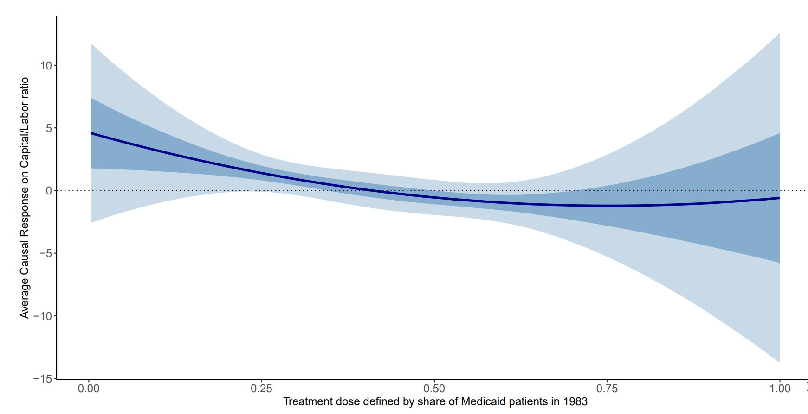
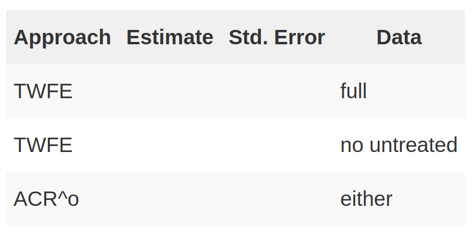
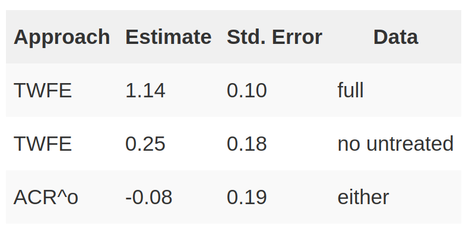
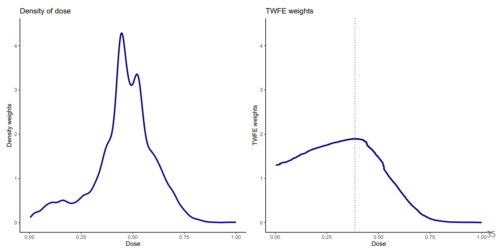
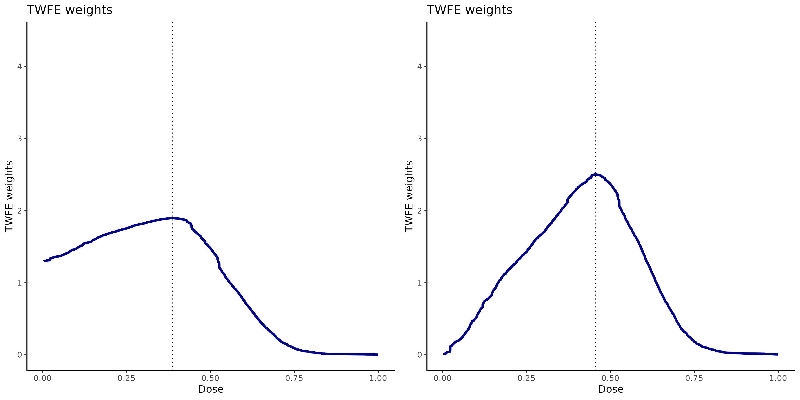
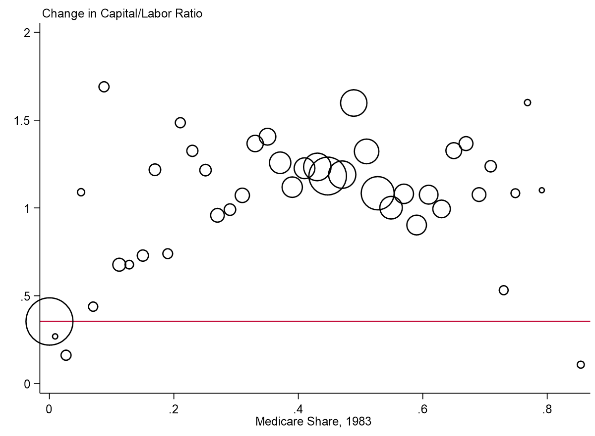
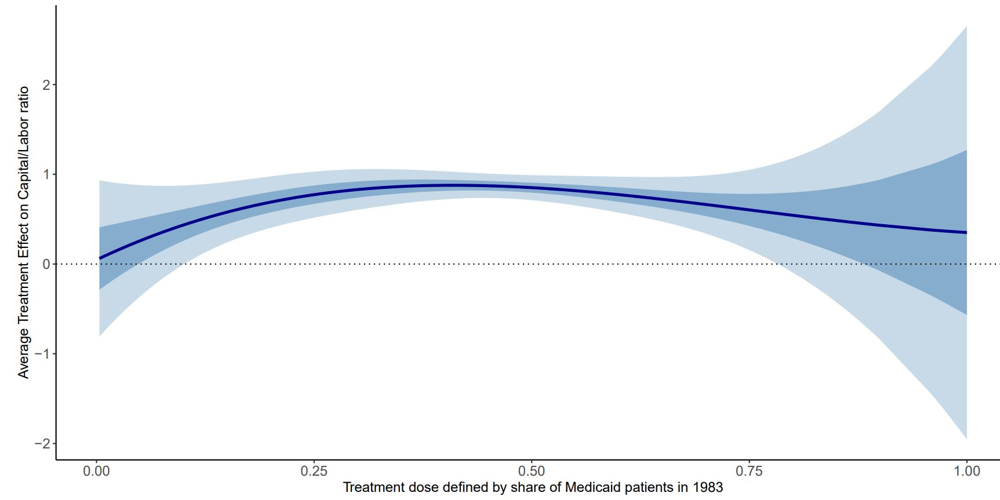

## Introduction

```{r echo=FALSE}
library(revealEquations)
```

$\newcommand{\E}{\mathbb{E}}
\newcommand{\E}{\mathbb{E}}
\newcommand{\var}{\mathrm{var}}
\newcommand{\cov}{\mathrm{cov}}
\newcommand{\Var}{\mathrm{var}}
\newcommand{\Cov}{\mathrm{cov}}
\newcommand{\Corr}{\mathrm{corr}}
\newcommand{\corr}{\mathrm{corr}}
\newcommand{\L}{\mathrm{L}}
\renewcommand{\P}{\mathrm{P}}
\newcommand{\independent}{{\perp\!\!\!\perp}}
\newcommand{\indicator}[1]{ \mathbf{1}\{#1\} }$Most recent work on DiD has focused on settings with a binary, staggered treatment


[This paper:]{.alert} Move from a setting with a binary treatment case to one with a [continuous treatment]{.alert-blue} ("dose")


Some of the arguments involve extending ideas from the binary, staggered treatment case to a setting with continuous treatment

* But we will also face new conceptual issues in this case that do not show up in a setting with a binary treatment


<span class="alert">Running Example:</span>

* Effect of $\underbrace{\textrm{length of school closures}}_{\textrm{continuous treatment}}$ (during Covid) on $\underbrace{\textrm{students' test scores}}_{\textrm{outcome}}$

    * e.g., @ager-eriksson-karger-nencka-thomasson-2024, @gillitzer-prasas-2023, among others


## Clarifications about Continuous Treatment - What's Included

For today, mostly emphasize a continuous treatment, but our results also apply to other settings (with trivial modifications):

* [Multi-valued treatments]{.alert} (e.g., effect of state-level minimum wage policies on employment)

* [Binary policy variable with differential exposure]{.alert} (application in the paper: a binary Medicare policy where different hospitals had more exposure to the policy)

## Clarifications about Continuous Treatment - What's Not Included

We will focus on a setting with a [panel data natural experiment]{.alert}

* No units are treated in the first period, some units become treated, with possibly different doses, in the second period

This narrows our focus and rules out:

1. [Heterogeneous adoption designs]{.alert} - where units are already treated in different amounts in the first period

    * See de Chaisemartin, D'Haultfoueille, and Vazquez (2024), de Chaisemartin et al. (2025)

2. [Fuzzy DiD]{.alert} - binary treatment but the researcher observes aggregate data, often using policy changes as an instrument
    <!--* Example: Study union wage-premium (at individual level) using state-level data and exploiting variation in the amount of unionization across different locations -->
    * See de Chaisemartin and D'Haultfoueille (2018) and @miyaji-2025

<span style="display: none;">[@chaisemartin-dhaultfoeuille-pasquier-sow-vazquez-2025]</span>
<span style="display: none;">[@chaisemartin-dhaultfoeuille-vazquez-2024]</span>
<span style="display: none;">[@chaisemartin-dhaultfoeuille-2018]</span>

## Today's Talk

<br> <br> <br>

1. Identification: What's the same as for a binary treatment?

2. Identification: What's different from a binary treatment?

3. Reverse Engineering TWFE Regressions

4. Empirical Application


# 1. Identification: What's the same as for a binary treatment? {visibility="uncounted"}


## Continuous Treatment Notation

- [Two time periods:]{.alert} $t=1$ and $t=2$
  - No one treated until period $t=2$
  - Some units remain untreated in period $t=2$

- [Treatment:]{.alert} $D_i$

- [Potential outcomes:]{.alert} $Y_{it=2}(d)$

- [Observed outcomes:]{.alert} $Y_{it=2}$ and $Y_{it=1}$

  $$Y_{it=2}=Y_{it=2}(D_i) \quad \textrm{and} \quad Y_{it=1}=Y_{it=1}(0)$$


## Parameters of Interest (ATT-type)

[Level Effects]{.alert} (Average Treatment Effect on the Treated)

$$ATT(d|d) := \E[Y_{t=2}(d) - Y_{t=2}(0) | D=d]$$

* Interpretation: The average effect of dose $d$ relative to not being treated *local to the group that actually experienced dose $d$*

* This is the natural analogue of $ATT$ in the binary treatment case


## Parameters of Interest (ACR-type)

[Slope Effects]{.alert} (Average Causal Response on the Treated)

$$ACRT(d|d) := \frac{\partial ATT(l|d)}{\partial l} \Big|_{l=d}$$

* Interpretation: $ACRT(d|d)$ is the causal effect of a marginal increase in dose *local to units that actually experienced dose $d$*

## Aggregated Parameters

Notice that $ATT(d|d)$ and $ACRT(d|d)$ are functional parameters

* This is different from $Y_{it} = \theta_t + \eta_i + \beta^{twfe} D_{it} + e_{it}$

We can view $ATT(d|d)$ and $ACRT(d|d)$ as the ["building blocks"]{.alert} for a more aggregated parameter.

[Aggregated versions]{.alert} of these (into a single number) are
\begin{align*}
  ATT^o := \E\Big[ATT(D|D)\Big|D>0\Big] \qquad \qquad ACRT^o := \E\Big[ACRT(D|D)\Big|D>0\Big]
\end{align*}

* $ATT^o$ averages $ATT(d|d)$ over the population distribution of the dose

* $ACRT^o$ averages $ACRT(d|d)$ over the population distribution of the dose
  * $ACRT^o$ is the natural target parameter for the TWFE regression in this case


## Identification

::: {.callout-note}
## Parallel Trends Assumption

For all $d \in \mathcal{D}_+$,

$$\E[\Delta Y(0) | D=d] = \E[\Delta Y(0) | D=0]$$
:::

```{r echo=FALSE, results="asis"}

title <- "Identification"

before <- "::: {.callout-note}

## Parallel Trends Assumption

For all $d \\in \\mathcal{D}_+$,

$$\\E[\\Delta Y(0) | D=d] = \\E[\\Delta Y(0) | D=0]$$

:::


Then,

. . .
"

eqlist <- list("ATT(d|d) &= \\E[Y_{t=2}(d) - Y_{t=2}(0) | D=d] \\hspace{150pt}",
               "&= \\E[Y_{t=2}(d) - Y_{t=1}(0) | D=d] - \\E[Y_{t=2}(0) - Y_{t=1}(0) | D=d]",
               "&= \\E[\\Delta Y | D=d] - \\E[\\Delta Y | D=0]")

after <- "<mark>This is exactly what you would expect</mark>

"
step_by_step_eq(eqlist=eqlist,
                before=before,
                after=after,
                title=title)
```

## Identification {visibility="uncounted"}

::: {.callout-note}
## Parallel Trends Assumption

For all $d \in \mathcal{D}_+$,

$$\E[\Delta Y(0) | D=d] = \E[\Delta Y(0) | D=0]$$
:::

Using similar arguments, you can show
$$ATT^o = \E[\Delta Y | D>0] - \E[\Delta Y | D=0]$$


# 2. Identification: What's different from a binary treatment? {visibility="uncounted"}


## Are we done?


<mark>Unfortunately, no</mark>

[Most empirical work with a continuous treatment wants to think about how causal responses vary across dose]{.alert}


* Plot treatment effects as a function of dose and ask: does more dose tends to increase/decrease/not affect outcomes?

::: {.notes}

oftentimes, our theory will have implications about effects at different values of the dose.  example, smoking, not just that people who smoked were more likely to get lung cancer but also that people who smoked *more* were more likely to get lung cancer than people who smoked less

:::

* Average causal response parameters *inherently* involve comparisons across slightly different doses

There are <span class="alert">new issues</span> related to comparing $ATT(d|d)$ at different doses and interpreting these differences as <span class="alert">causal effects</span>

<!-- * At a high-level, these issues arise from a tension between empirical researchers wanting to use a quasi-experimental research design (which delivers "local" treatment effect parameters) but (often) wanting to compare these "local" parameters to each other -->

* Unlike the staggered, binary treatment case: No easy fixes here!


```{r echo=FALSE, results="asis"}
title <- "Interpretation Issues"

before <- "Consider comparing $ATT(d|d)$ for two different doses

. . .

"

eqlist <- list("& ATT(d_h|d_h) - ATT(d_l|d_l) \\hspace{350pt}",
               "& \\hspace{25pt} = \\E[Y_{t=2}(d_h)-Y_{t=2}(d_l) | D=d_h] + \\E[Y_{t=2}(d_l) - Y_{t=2}(0) | D=d_h] - \\E[Y_{t=2}(d_l) - Y_{t=2}(0) | D=d_l]",
               "& \\hspace{25pt} = \\underbrace{\\E[Y_{t=2}(d_h) - Y_{t=2}(d_l) | D=d_h]}_{\\textrm{Causal Response}} + \\underbrace{ATT(d_l|d_h) - ATT(d_l|d_l)}_{\\textrm{Selection Bias}}")

after <- "\n

. . .

\"Standard\" Parallel Trends is not strong enough to rule out the selection bias terms here

* Implication: If you want to interpret differences in treatment effects across different doses, then you will need stronger assumptions than standard parallel trends

* This problem spills over into identifying $ACRT(d|d)$

. . .


"

step_by_step_eq(eqlist=eqlist,
                before=before,
                after=after,
                title=title)

```

## Interpretation Issues

<span class="alert">Intuition: </span>

* Difference-in-differences identification strategies result in $ATT(d|d)$ parameters.  These are <span class="highlight">local parameters</span> and difficult to compare to each

* This explanation is similar to thinking about LATEs with two different instruments

* Thus, comparing $ATT(d|d)$ across different values is tricky and not for free

<span class="alert">What can you do?</span>

* One idea, just recover $ATT(d|d)$ and interpret it cautiously (interpret it by itself not relative to different values of $d$)

* If you want to compare them to each other, it will come with the cost of additional (structural) assumptions


## Introduce Stronger Assumptions

::: {.callout-note}

## Strong Parallel Trends Assumption

For doses `d` $\in \mathcal{D}$ and `l` $\in \mathcal{D}_+$,

$$\mathbb{E}[Y_{t=2}(d) - Y_{t=1}(0) | D=l] = \mathbb{E}[Y_{t=2}(d) - Y_{t=1}(0) | D=d]$$

:::

::: {.fragment}

* This is notably different from "Standard" Parallel Trends

* It involves potential outcomes for all values of the dose (not just untreated potential outcomes)

* All dose groups would have experienced the same path of outcomes had they been assigned the same dose

:::


```{r echo=FALSE, results="asis"}

title <- "Introduce Stronger Assumptions"

before <- "

Strong parallel trends is equivalent to a certain [restriction on treatment effect heterogeneity]{.alert}.  Notice:

"

# eqlist <- list("ATT(d|d) &= \\E[Y_{t=2}(d) - Y_{t=2}(0) | D=d] \\hspace{200pt} \\",
#               "&= \\E[Y_{t=2}(d) - Y_{t=1}(0) | D=d] - \\E[Y_{t=2}(0) - Y_{t=1}(0) | D=d] \\",
#               "&= \\E[Y_{t=2}(d) - Y_{t=1}(0) | D=l] - \\E[Y_{t=2}(0) - Y_{t=1}(0) | D=l] \\",
#               "&= \\E[Y_{t=2}(d) - Y_{t=2}(0) | D=l] = ATT(d|l)")

eqlist <- list("ATT(d|d) &= \\E[Y_{t=2}(d) - Y_{t=1}(0) | D=d] - \\E[Y_{t=2}(0) - Y_{t=1}(0) | D=d] \\hspace{200pt} \\",
               "&= \\E[Y_{t=2}(d) - Y_{t=1}(0) | D=l] - \\E[Y_{t=2}(0) - Y_{t=1}(0) | D=l] \\",
               "&= \\E[Y_{t=2}(d) - Y_{t=2}(0) | D=l] = ATT(d|l)")

after <- "

. . .

Since this holds for all $d$ and $l$, it also implies that

$$ATT(d|d) = ATT(d) = \\E[Y_{t=2}(d) - Y_{t=2}(0)|D>0]$$

Thus, under strong parallel trends, we have that

$$ATT(d) = \\E[\\Delta Y|D=d] - \\E[\\Delta Y|D=0]$$

RHS is exactly the same expression as for $ATT(d|d)$ under \"standard\" parallel trends, but here

* assumptions are different

* parameter interpretation is different


"

step_by_step_eq(title=title,
                before=before,
                eqlist=eqlist,
                after=after)

```


```{r echo=FALSE, results="asis"}

title <- "Comparisons across Dose"

before <- "ATT(d) parameters do not suffer from the same issues as ATT(d|d) parameters when making comparisons across dose

. . .

"

eqlist <- list("ATT(d_h) - ATT(d_l) &= \\E[Y_{t=2}(d_h) - Y_{t=2}(0) | D>0] - \\E[Y_{t=2}(d_l) - Y_{t=2}(0)|D>0]",
              "&= \\underbrace{\\E[Y_{t=2}(d_h) - Y_{t=2}(d_l)|D>0]}_{\\textrm{Causal Response}}")

after <- "

. . .

<mark>Thus, recovering $ATT(d)$ side-steps the issues about comparing treatment effects across doses, but it comes at the cost of needing a (potentially very strong) extra assumption</mark>

. . .

Given that we can compare $ATT(d)$'s across dose, we can recover slope effects in this setting

$$
\\begin{aligned}
  ACR(d) := \\frac{\\partial ATT(d)}{\\partial d} \\qquad &\\textrm{or} \\qquad ACR^o := \\E\\Big[ACR(D) \\Big| D>0\\Big]
\\end{aligned}
$$

"

step_by_step_eq(eqlist=eqlist,
                before=before,
                after=after,
                title=title)
```

## Additional Comments

* [Can you relax strong parallel trends?](#can-you-relax-strong-parallel-trends)

* [Positive side-comment: No untreated units](#positive-side-comments-no-untreated-units)

* [Positive side-comment: Binarizing the Treatment](#positive-side-comments-alternative-approaches)

* [Negative side-comment: Pre-testing](#negative-side-comment-pre-testing)


## Summarizing

It is straightforward/familiar to identify ATT(d|d) parameters with a multi-valued or continuous dose

However, comparison of ATT(d|d) parameters across different doses are hard to interpret

- They include selection bias terms
- This issues extends to identifying ACRT parameters
- These issues extend to TWFE regressions

This suggests targeting ATT(d) parameters

- Comparisons across doses do not contain selection bias terms
- But identifying ATT(d) parameters requires stronger assumptions

# 3. Reverse Engineering TWFE Regressions {visibility="uncounted"}

## TWFE Regressions in this Context

Consider the same TWFE regression as before:
\begin{align*}
  Y_{it} = \theta_t + \eta_i + \beta^{twfe} D_{it} + e_{it}
\end{align*}
We show that
\begin{align*}
  \beta^{twfe} = \int_{\mathcal{D}_+} w(l) m'_\Delta(l) \, dl
\end{align*}
where $m_\Delta(l) := \E[\Delta Y|D=l] - \E[\Delta Y|D=0]$ and $w(l)$ are weights

* Under standard parallel trends, $m'_{\Delta}(l) = ACRT(l|l) + \textrm{local selection bias}$

  <!--$\implies$ issues related to selection bias continue to show up here-->

* Under strong parallel trends, $m'_{\Delta}(l) = ACR(l)$.

About the weights: they are all positive, but have some strange properties (e.g., always maximized at $l = \E[D]$ (even if this is not a common value for the dose))

* $\implies$ even under strong parallel trends, $\beta^{twfe} \neq ACR^o$.


## TWFE Regressions in this Context

Other issues can arise in more complicated cases

* For example, suppose you have a staggered continuous treatment, then you will *additionally* get issues that are analogous to the ones we discussed earlier for a binary staggered treatment

* In general, things get worse for TWFE regressions with more complications

## Estimation - What Should You Do?

[Level Effects]{.alert} - no issues related to selection bias

* [For $ATT^o$:]{.alert-blue} Binarize treatment, $ATT^o = \E[\Delta Y | D > 0] - \E[\Delta Y | D=0]$.

* [For $ATT(d|d)$:]{.alert-blue} Nonparametrically estimate $m_\Delta(d) = \E[\Delta Y|D=d]-\E[\Delta Y|D=0]$

    * This is not actually too hard to estimate.  No curse-of-dimensionality, etc.

[Slope Effects]{.alert} - must deal with selection bias

* Nonparametrically estimate derivative of $m_\Delta(d)$

* [For $ACR(d)$:]{.alert-blue} Under strong parallel trends, derivative is equal to $ACR(d)$

* [For $ACR^o$:]{.alert-blue} Average $ACR(D)$ over $D>0$; i.e., $ACR^o = \E[ACR(D)|D>0]$

. . .

[Additional Comments:]{.alert}

1. Changing the estimation strategy helps with the weights, but it does not fix the issues related to standard vs. strong parallel trends

<!--[Back](#twfe-short)-->

## Estimation - What should you do? {visibility="uncounted"}

[Level Effects]{.alert} - no issues related to selection bias

* [For $ATT^o$:]{.alert-blue} Binarize treatment, $ATT^o = \E[\Delta Y | D > 0] - \E[\Delta Y | D=0]$.

* [For $ATT(d|d)$:]{.alert-blue} Nonparametrically estimate $m_\Delta(d) = \E[\Delta Y|D=d]-\E[\Delta Y|D=0]$

    * This is not actually too hard to estimate.  No curse-of-dimensionality, etc.

[Slope Effects]{.alert} - must deal with selection bias

* Nonparametrically estimate derivative of $m_\Delta(d)$

* [For $ACR(d)$:]{.alert-blue} Under strong parallel trends, derivative is equal to $ACR(d)$

* [For $ACR^o$:]{.alert-blue} Average $ACR(D)$ over $D>0$; i.e., $ACR^o = \E[ACR(D)|D>0]$

[Additional Comments:]{.alert}

2. It's relatively straightforward to extend this strategy to settings with multiple periods and variation in treatment timing by extending existing work about a staggered, binary treatment


# 4. Empirical Application {visibility="uncounted"}


## Empirical Application {#empirical-application-short}

[Application:]{.alert} Simplified version of Acemoglu and Finkelstein (2008)

[Setting:]{.alert} 1983 Medicare reform that eliminated labor subsidies for hospitals

[Dose:]{.alert} Hospital's exposure to reform by fraction of Medicare patients pre-treatment

[Outcome:]{.alert} Hospital's capital-labor ratio

[Focus:]{.alert} Comparison of estimates of $ACR^o$ to $\beta^{twfe}$

* They are both weighted averages of $ACR(d)$, only the weights differ

<br><br>

[More details](#empirical-application-details)

## ACR(d) Plot

<center>  </center>

## Results

<center>  </center>

## Results {visibility="uncounted"}

<center>  </center>

<!--

$TWFE$: 1.14 (s.e.: 0.10)

* "Given that the average hospital has a 38 percent Medicare share prior to PPS, this estimate suggests that in its first three years, the introduction of PPS was associated with an increase in the depreciation share of about 0.42 (=1.13*0.38)...corresponds to a sizable 10 percent increase in the capital-labor ratio of the average Medicare share hospital."

* Probably most natural comparison for this parameter is $\widehat{ATT}(d=0.38|d=0.38) = 0.87$ (s.e.: 0.09).


Can also use the TWFE estimate to think about causal responses

* $\widehat{ACRT}^o:$ -0.078 (s.e.: ??)


Finally, if only want to exploit variation in the dose

* $TWFE$ (no untreated): 0.25 (s.e. 0.18)

* Our approach: $ATT(d|d)$ not available in this case, $ACRT^o$ does not change

-->


## Density weights vs. TWFE weights

<center>  </center>


## TWFE Weights with and without Untreated Group

<center>  </center>

<!--[Back](#application-medicare-reform-and-capitallabor-ratios)-->


## Conclusion

* There are a number of challenges to implementing/interpreting DiD with a continuous treatment

* The extension to multiple periods and variation in treatment timing is relatively straightforward (at least proceeds along the "expected" lines)

* But (in my view) the main new issue here is that <span class="alert">justifying interpreting comparisons across different doses as causal effects requires stronger assumptions than most researchers probably think that they are making</span>

* Link to paper: [https://arxiv.org/abs/2107.02637](https://arxiv.org/abs/2107.02637)


<!--
* <mark>Other Summaries:</mark> &nbsp; (i) [Five minute summary](https://bcallaway11.github.io/posts/five-minute-did-continuous-treatment) &nbsp; &nbsp; &nbsp;  (ii) [Pedro's Twitter](https://twitter.com/pedrohcgs/status/1415915759960690696)
-->

# Thank you

[brantly.callaway@uga.edu](mailto:brantly.callaway@uga.edu)


<!--
* <mark>Code:</mark> in progress

-->

# Appendix {visibility="uncounted"}

## References {visibility="uncounted"}

::: {#refs}
:::

## Can you relax strong parallel trends? {visibility="uncounted"}

Some ideas:

* It could be reasonable to assume that you know the sign of the selection bias.  This can lead to (possibly) informative bounds on differences/derivatives/etc. between $ATT(d|d)$ parameters

. . .

* If interest is mainly in $ACRT$'s, then can weaken the assumption to something like "local" strong parallel trends

. . .

* Strong parallel trends may be more plausible after conditioning on some covariates.

  * For length of school closure, strong parallel trends probably more plausible conditional on being a rural county in the Southeast or conditional on being a college town in the Midwest.

  <!-- this probably does not fully rationalize recovering ATT(d), but could allow for some cross-dose comparisons...-->

[Back](#additional-comments)

## Positive Side-Comments: No untreated units {visibility="uncounted"}

It's possible to do some versions of DiD with a continuous treatment without having access to a fully untreated group.

  * In this case, it is not possible to recover level effects like $ATT(d|d)$.

  * However, notice that $$\begin{aligned}& \E[\Delta Y | D=d_h] - \E[\Delta Y | D=d_l] \\ &\hspace{50pt}= \Big(\E[\Delta Y | D=d_h] - \E[\Delta Y(0) | D=d_h]\Big) - \Big(\E[\Delta Y | D=d_l]-\E[\Delta Y(0) | D=d_l]\Big) \\ &\hspace{50pt}= ATT(d_h|d_h) - ATT(d_l|d_l)\end{aligned}$$

  * In words: comparing path of outcomes for those that experienced dose $d_h$ to path of outcomes among those that experienced dose $d_l$ (and not relying on having an untreated group) delivers the difference between their $ATT$'s.

  * Still face issues related to selection bias / strong parallel trends though

[Back](#additional-comments)


## Positive Side-Comments: Alternative approaches {visibility="uncounted"}

Strategies like binarizing the treatment can still work (though be careful!)

  * If you classify units as being treated or untreated, you can recover the $ATT^o$ by comparing mean outcome for treated relative to untreated.

  * On the other hand, if you classify units as being "high" treated, "low" treated, or untreated &mdash; our arguments imply that selection bias terms can come up when comparing effects for "high" to "low"

[Back](#additional-comments)

## Negative Side-Comment: Pre-testing {visibility="uncounted"}

That the expressions for $ATT(d)$ and $ATT(d|d)$ are exactly the same also means that we cannot use pre-treatment periods to try to distinguish between "standard" and "strong" parallel trends.
In particular, the relevant information that we have for testing each one is the same

* In effect, the only testable implication of strong parallel trends in pre-treatment periods is standard parallel trends.

[Back](#additional-comments)


## Ex. Mixture of Normals Dose {visibility="uncounted"}

```{r echo=FALSE, message=FALSE, warning=FALSE, fig.width=15}
library(mixtools)
library(ggplot2)
draws <- rnormmix(1000,lambda=c(.5,.5),mu=c(5,12),sigma=c(1,1))
dgrid <- seq(min(draws), max(draws), length.out=100)#seq(quantile(draws,.01), quantile(draws,.99), length.out=100)
meanD <- mean(draws)
varD <- var(draws)
ED_l <- function(l) mean(draws[draws >= l])
PD_l <- function(l) mean(1*(draws>=l))
w_l <- function(l) (ED_l(l) - meanD)*PD_l(l)/varD
waits <- sapply(dgrid, w_l)
plot_df <- data.frame(weight=waits, D=dgrid)
weights_plot <- ggplot(plot_df, aes(x=D,y=weight)) +
  geom_line(color="blue", lwd=1.3) +
  labs(title="TWFE Weights") +
  theme_minimal() +
  ylim(c(0,.2)) +
  xlim(c(1,16))
density_plot <- ggplot(data=data.frame(D=draws), aes(x=D)) +
  geom_density(color="red", lwd=1.3) +
  labs(title="Density of Dose") +
  theme_minimal() +
  ylim(c(0,.2)) +
  xlim(c(1,16))
ggpubr::ggarrange(density_plot,weights_plot, nrow=1)
```

[Back](#issues)

## Ex. Exponential Dose {visibility="uncounted"}
```{r echo=FALSE, warning=FALSE, fig.width=15}
draws <- rexp(1000, rate=1)
dgrid <- seq(min(draws), max(draws), length.out=100)#seq(quantile(draws,.01), quantile(draws,.99), length.out=100)
meanD <- mean(draws)
varD <- var(draws)
ED_l <- function(l) mean(draws[draws >= l])
PD_l <- function(l) mean(1*(draws>=l))
w_l <- function(l) (ED_l(l) - meanD)*PD_l(l)/varD
waits <- sapply(dgrid, w_l)
plot_df <- data.frame(weight=waits, D=dgrid)
weights_plot <- ggplot(plot_df, aes(x=D,y=weight)) +
  geom_line(color="blue", lwd=1.3) +
  labs(title="TWFE Weights") +
  theme_minimal() +
  ylim(c(0,1)) +
  xlim(c(0,7))
density_plot <- ggplot(data=data.frame(D=draws), aes(x=D)) +
  geom_density(color="red", lwd=1.3) +
  labs(title="Density of Dose") +
  theme_minimal() +
  ylim(c(0,1)) +
  xlim(c(0,7))
ggpubr::ggarrange(density_plot,weights_plot, nrow=1)
```

[Back](#issues)

## Empirical Application {#empirical-application-details visibility="uncounted"}

This is a simplified version of Acemoglu and Finkelstein (2008)

1983 Medicare reform that eliminated labor subsidies for hospitals

* Medicare moved to the Prospective Payment System (PPS) which replaced "full cost reimbursement" with "partial cost reimbursement" which eliminated reimbursements for labor (while maintaining reimbursements for capital expenses)

* Rough idea: This changes relative factor prices which suggests hospitals may adjust by changing their input mix.  Could also have implications for technology adoption, etc.

* In the paper, we provide some theoretical arguments concerning properties of production functions that suggests that strong parallel trends holds.


## Data {visibility="uncounted"}

Annual hospital-reported data from the American Hospital Association, 1980-1986

. . .

Outcome is capital/labor ratio

* proxy using the depreciation share of total operating expenses (avg. 4.5%)

* our setup: collapse to two periods by taking average in pre-treatment periods and average in post-treatment periods

Dose is "exposure" to the policy

* the fraction of Medicare patients in the period before the policy was implemented

* roughly 15% of hospitals are untreated (have essentially no Medicare patients)

  * AF provide results both using and not using these hospitals as (good) it is useful to have untreated hospitals (bad) they are fairly different (includes federal, long-term, psychiatric, children's, and rehabilitation hospitals)


## Bin Scatter  {visibility="uncounted"}

<center>  </center>


## ATT(d) Plot {visibility="uncounted"}

<center>  </center>

$\widehat{ATT}^o = 0.80~~(\textrm{s.e}.=0.05)$ [Back](#empirical-application-short)