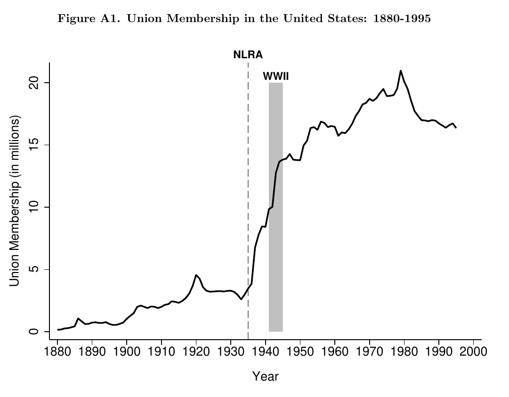
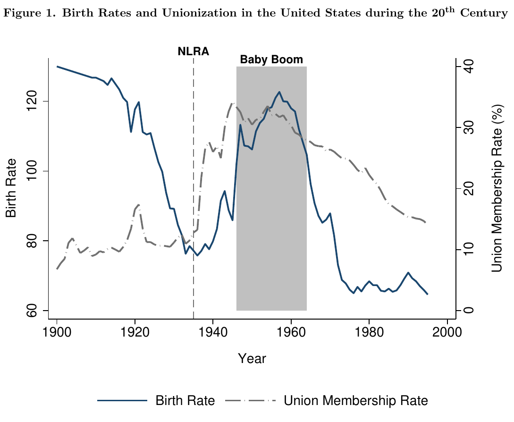
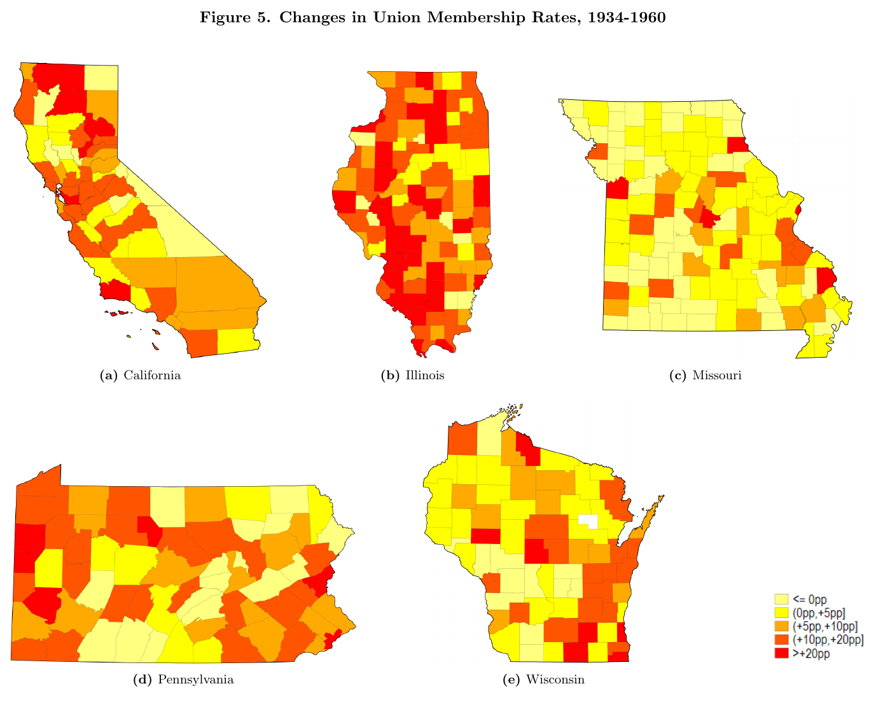
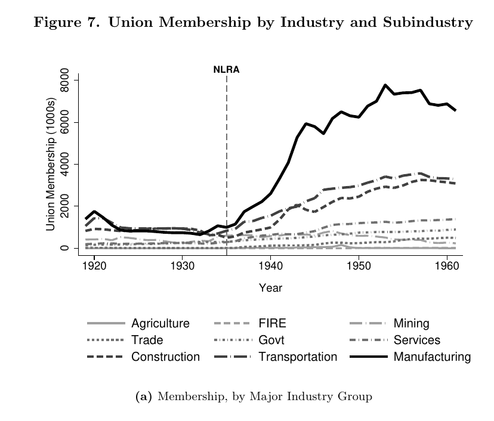
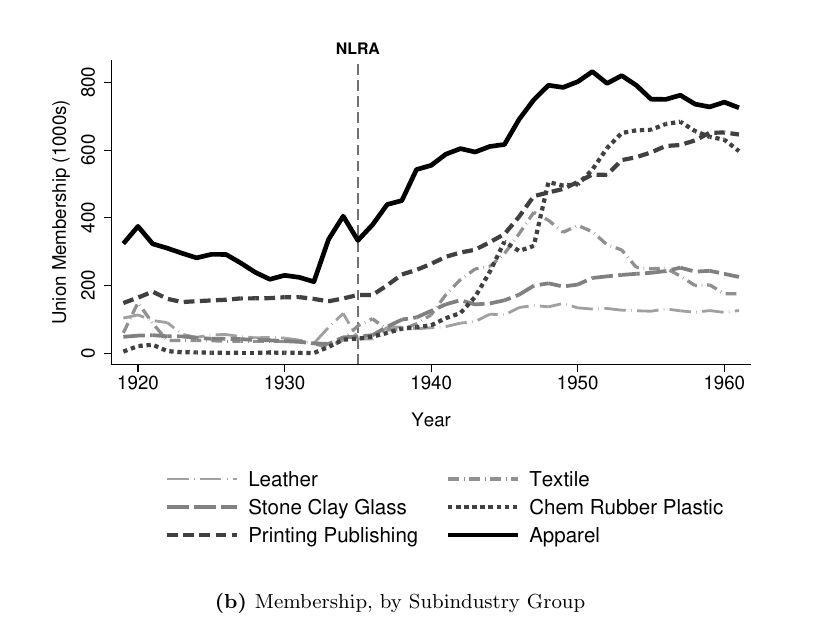
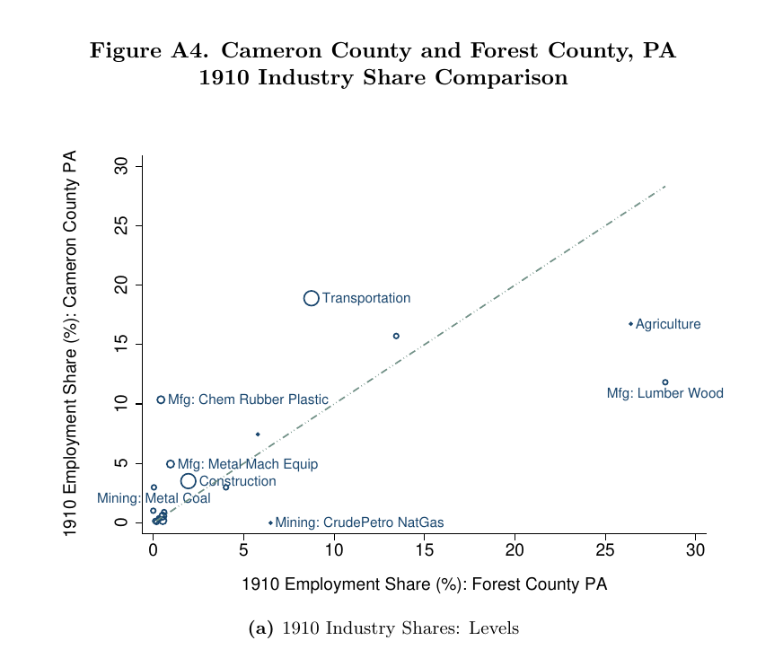
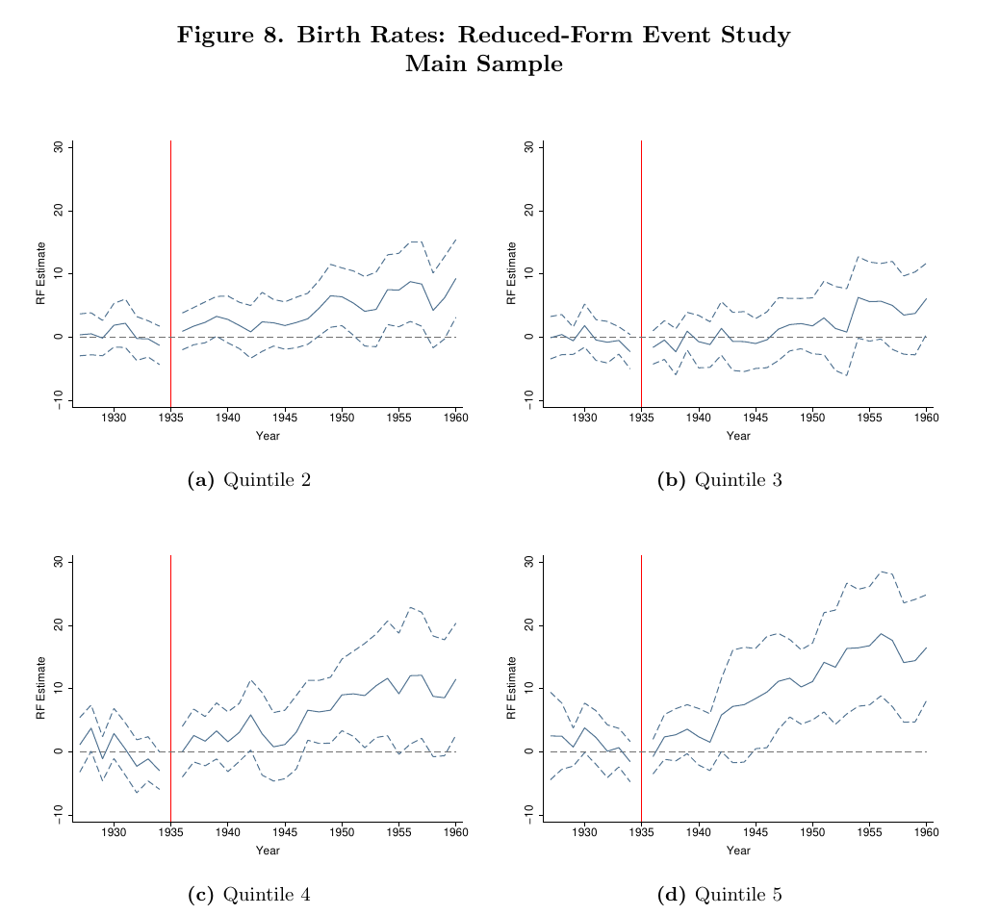
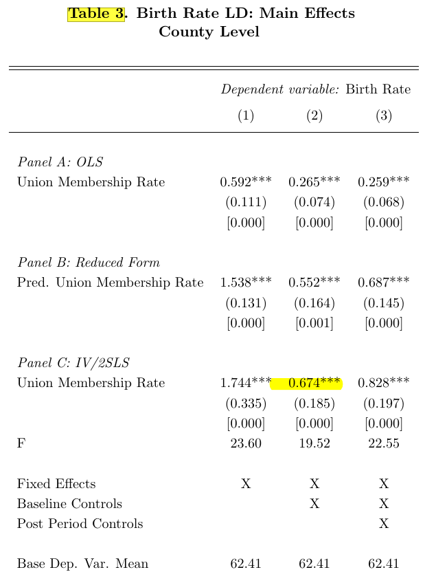

## Introduction

```{r echo=FALSE}
library(revealEquations)
```

$\newcommand{\E}{\mathbb{E}}
\newcommand{\var}{\mathrm{var}}
\newcommand{\cov}{\mathrm{cov}}
\newcommand{\Var}{\mathrm{var}}
\newcommand{\Cov}{\mathrm{cov}}
\newcommand{\Corr}{\mathrm{corr}}
\newcommand{\corr}{\mathrm{corr}}
\newcommand{\L}{\mathrm{L}}
\renewcommand{\P}{\mathrm{P}}
\newcommand{\independent}{{\perp\!\!\!\perp}}
\newcommand{\indicator}[1]{ \mathbf{1}\{#1\} }
\newcommand{\ATT}{\text{ATT}}
\newcommand{\ACR}{\text{ACR}}$
[Shift-share]{.alert} (aka Bartik) variables are created as combinations of

* [Shares]{.alert-blue} --- how exposed each unit is to a common shocks
* [Shifts]{.alert-green} --- common, aggregate-level shocks

Combining these creates a single variable capturing how "exposed" a unit is to some shocks

[This session:]{.alert} An overview of shift-share designs for causal inference

* These variables are often used to address endogeneity concerns in applications
* Emphasize that there are strong connections between shift-share and difference-in-differences with a continuous treatment from previous sessions.

## Plan for This Session

<br>

1. Introduction to shift-share designs and an application

2. Constructing shift-share variables

3. Causal effects

4. Extensions

# 1. Introduction to Shift-Share Designs and an Application {visibility="uncounted"}

## Main Reference Papers

1. @goldsmith-sorkin-swift-2020

2. @chaisemartin-lei-2023

3. @borusyak-hull-jaravel-2025

## Running Example: @downes-2024

[Question:]{.alert} Did the expansion of labor unions contribute to the American Baby Boom?

[Setting:]{.alert} The 1935 National Labor Relations Act (NLRA) --- the largest expansion of unionism in U.S. history

* [Treatment $D_{it}$:]{.alert-blue} county-level union membership rate

* [Outcome $Y_{it}$:]{.alert-blue} county-level birth rates

[Target Parameter:]{.alert-green} Not always clear in the literature (i.e., often stated as a regression coefficient), but something like $\ACR(d) = \frac{\partial \E[Y_{it}(d)]}{\partial d}$---how much a marginal increase in unionization would raise fertility

## Other Empirical Examples

@downes-2024 is representative of many shift-share papers, but let me mention a few more well known ones:

<br>

::: {style="font-size: 0.65em;"}

| Paper | Unit | Treatment $D$ | Outcome $Y$ |
|---|---|---|---|
| @bartik-1991, @blanchard-katz-1992 | Region | $\Delta$ local employment | $\Delta$ local wages |
| @card-2001 | City $\times$ skill group | Immigrant inflows | Native wages and employment |
| @autor-dorn-hanson-2013 | Commuting zone | $\Delta$ exposure to Chinese imports | $\Delta$ manufacturing employment |
| @nunn-qian-2014 | Country | US food aid (wheat) received | Civil conflict |
| @greenstone-mas-nguyen-2020 | County | $\Delta$ bank credit supply | $\Delta$ employment |
| @xu-2022 | Region | Exposure to bank failures | $\Delta$ exports |
| @franklin-imbert-abebe-mejia-mantilla-2024 | Local labor market | Exposure to public works program | Wages |

:::

## Common Features of These Applications

* [Aggregated data]{.alert}, e.g., counties, commuting zones, regions, countries
  * This probably creates issues for defining potential outcomes, e.g., writing $Y_{it}(d)$ for a county probably violates SUTVA as the birth rate in a county likely depends on who exactly gets unionized not just the unionization rate in a county.
  * The literature seems to ignore this, so we will too

* Some of these papers are interested in the effect of ["exposure"]{.alert-blue} but where the notion of exposure is more complicated than the examples we discussed earlier for DiD with a continuous treatment
  * In these cases, you can think of the shift-share variable not so much as an instrument, but as a way to reduce exposure from a high-dimensional object into a single number

* Other papers are primarily worried about [endogeneity]{.alert-green} of the treatment, and will use the shift-share variable as an instrument

##

{fig-align="center"}

##

{fig-align="center"}

##

{fig-align="center"}

## Simplified Setting

Start with a simplified setting similar to the one we have been considering:

* Two periods: $t=1$ (pre-NLRA) and $t=2$ (post-NLRA)
* No units treated in the first period---this almost holds in the application, but not quite
  * Important to relax later as many shift-share applications involve aggregated data where it is uncommon for there to be a period where units are fully untreated.

## @downes-2024's Main Concern

[Endogeneity:]{.alert} locations with tight labor markets may experience higher unionization *but* a tight labor market may also affect the trend in county fertility even without unionization.

This is directly related to our earlier discussion of continuous treatments.  Here the worry is that parallel trends and/or strong parallel trends is violated:

$\text{Violation of Parallel Trends: } \E[\Delta Y(0) \mid D=d] \neq \E[\Delta Y(0) \mid D=0]$

or

$\text{Violation of Strong Parallel Trends: } \E[\Delta Y(d) \mid D=d'] \neq \E[\Delta Y(d) \mid D=d]$


# 2. Constructing Shift-Share Variables {visibility="uncounted"}


## Constructing a Shift-Share Variable

To start with, notice that

$$ D_{it=2} = \sum_{j=1}^J s_{ijt=2} \times r_{ijt=2}$$

where

* $D_{it=2}$ is the unionization rate in county $i$ at time $t=2$ (post-NLRA)
* $s_{ijt=2}$ is the share of county $i$'s employment in industry $j$ at time $t=2$
* $r_{ijt=2}$ is the unionization rate in county $i$ for industry $j$ at time $t=2$

This is a decomposition and holds by definition.

## Constructing a Shift-Share Variable

Next, we can decompose the industry share variable $s_{ijt=2}$ and the industry unionization rate $r_{ijt=2}$ as follows:

$$s_{ijt=2} = \color{red}{s_{ijt=1}} + \Delta s_{ij}$$

where $\color{red}{s_{ijt=1}}$ is the share of county $i$'s employment in industry $j$ at time $t=1$ (pre-NLRA) and $\Delta s_{ij}$ is the change in that share from $t=1$ to $t=2$.

$$r_{ijt=2} = \color{blue}{r_{jt=2}} + \tilde{r}_{ijt=2}$$

where $\color{blue}{r_{jt=2}}$ is the national unionization rate in industry $j$ at time $t=2$ and $\tilde{r}_{ijt=2}$ is the unionization rate remainder in county $i$ for industry $j$ at time $t=2$.

Roughly, the idea of a shift-share variable is that $s_{ijt=1}$ and/or $r_{jt=2}$ are more likely to be exogenous than the treatment $D_{it=2}$ itself.

## Constructing a Shift-Share Variable

We can now construct a shift-share variable as follows:
$$ B_{i} = \sum_{j=1}^J s_{ijt=1} \times r_{jt=2} $$

This is following the notation in @goldsmith-sorkin-swift-2020, you can think of $B$ standing for "Bartik"

## Constructing a Shift-Share Variable

@downes-2024 writes the same equation as:
$$SSIV_{it} = \sum_{j=1}^J \underbrace{\textrm{IndShare}^{1910}_{ij}}_{\textrm{share}} \times \underbrace{\textrm{NatlUnionRate}_{jt}}_{\textrm{shift}}$$

* [Shares:]{.alert-blue} local industry composition, measured in 1910, before the NLRA
* [Shifts:]{.alert} national, industry-level union membership rates over time

## Constructing a Shift-Share Variable

$B_i$ represents the "exposure" of different counties to unionization:

* Some industries were far more amenable to unionization than others (long-lived capital, scarce skilled labor, spatial isolation)
* Some counties had more of those industries than others

##

{fig-align="center"}

##

{fig-align="center"}


## Variation in $B_i$: An Example

@downes-2024 gives a concrete two-county example:

* Cameron County, PA and Forest County, PA --- similar 1930 population ($\approx 5{,}200$), neither unionized before the NLRA

* But Cameron had more transportation, more coal mining, and more of the manufacturing subindustries that later unionized heavily

This implies that these two counties were differently exposed to the NLRA shock.

##

{fig-align="center"}

# 3. Causal Effects {visibility="uncounted"}

## What Does the Shift-Share Being Exogenous Mean?

The way that @goldsmith-sorkin-swift-2020 discuss exogeneity of the shift-share variable is through [exogeneity of the shares]{.alert}.

For simplicity, think about the case with two industries $j=1,2$:

[Notation:]{.alert-blue}

* $D(s_{1}, s_{2})$---the unionization rate in a particular county in the second period if the shares were set to $s_{1}$ and $s_{2}$.
* $Y_{it=2}(d,s_{1},s_{2})$---the potential outcome for county $i$ at time $t=2$ if the treatment were set to $d$ and the shares were set to $s_{1}$ and $s_{2}$.

## What Does the Shift-Share Being Exogenous Mean?

The way that @goldsmith-sorkin-swift-2020 discuss exogeneity of the shift-share variable is through [exogeneity of the shares]{.alert}.

For simplicity, think about the case with two industries $j=1,2$:

IV-type assumptions:

* [Exclusion restriction:]{.alert-blue} $Y_{it=2}(d,s_{1},s_{2}) = Y_{it=2}(d)$---shares only affect outcomes through the treatment $D_i$
* [Independence:]{.alert-green} $\Big(S_{1}, S_{2}\Big) \independent \Big( \Delta Y_{it=2}(d), D(s_1, s_2) \Big)$---the shares are independent of the change in potential outcomes over time and the potential treatment

These are exactly the same type of assumption as you would see in the IV literature, applied to the shares.


## Causal Effect of the Shares

Under exogeneity of the shares, it immediately holds that, e.g.,

$$ \E[\Delta Y \mid S_1 = s_1, S_2 = s_2] - \E[\Delta Y \mid S_1 = s_1', S_2 = s_2'] = \underbrace{\E[Y_{t=2}(s_1, s_2) - Y_{t=2}(s_1', s_2')]}_{\text{causal effect of shares}} $$

where $Y_{t=2}(s_1, s_2) := Y_{t=2}(D(s_1, s_2))$ is the potential outcome if the shares were set to $s_1$ and $s_2$.

i.e., we can compare the trend in outcomes across counties with different shares and interpret that as a causal effect of different shares.

## Limitations of Previous Result

However, the expression on the previous slide

* Does not use the shift-share variable,
* Does not really tell us anything about the causal effect of unionization, just the causal effect of different shares,
* It is hard to operationalize, especially when the number of industries is large.

## Alternative Estimand

Instead, a natural estimand to consider is:

$$ \E[\Delta Y \mid B = b+1] - \E[\Delta Y \mid B = b] $$

which is the difference in trends in outcomes across counties with different values of the shift-share variable.

## Interpreting Shift-Share Estimand

It is straightforward to show that, under the previous assumptions, the previous estimand is equal to
$$\E\Big[ \E[Y_{t=2}(S_1,S_2)] \Bigm| B = b+1\Big] - \E\Big[ \E[Y_{t=2}(S_1,S_2)] \Bigm| B = b\Big]$$

This is not exactly what we want, though:

* We are averaging over shares for $B=b+1$ and $B=b$, but we are not really comparing across marginal changes in the shares
* The composition of shares at $B=b+1$ could be much different from the composition of shares at $B=b$.

## Shift-Share Aggregation Assumption

We can additionally assume that

$$D(s_1,s_2) = D(b)$$

for all $s_1, s_2$ such that $s_1 r_1 + s_2 r_2 = b$. In other words, the amount of unionization in a county is invariant to the particular shares, as long as the shift-share variable is the same.

This allows us to causally interpret comparisons of counties with $B=b+1$ to counties with $B=b$ even if they have substantially different underlying shares

Then, it immediately follows that

$$\E[\Delta Y \mid B = b+1] - \E[\Delta Y \mid B = b] =\E[Y_{t=2}(b+1) - Y_{t=2}(b)]$$

which is the causal effect of a marginal increase in the shift-share variable.

## Connection to Strong Parallel Trends

There's a close connection between the previous result and strong parallel trends.

Notice that we are making comparisons across dose, so we need more than just parallel trends in "unexposed" potential outcomes.

$$\text{Parallel Trends: } \E[\Delta Y(0) \mid B=b] = \E[\Delta Y(0) \mid B=0]$$

But the previous assumptions imply a version of strong parallel trends in terms of the shift-share variable:

$$\text{Strong Parallel Trends: } \E[\Delta Y(b) \mid B=b'] = \E[\Delta Y(b) \mid B=b]$$

This is exactly what rationalizes comparing trends in outcomes across counties with different values of the shift-share variable as being causal effects of exposure.

##

{fig-align="center"}


## Using the Shift-Share Variable as an Instrument

To recover the causal effect of the treatment, a natural estimand is the derivatve version of the Wald estimand:

$$ \tau(b) := \frac{\partial \E[\Delta Y \mid B=b]}{\partial b} \bigg/ \frac{\partial \E[D \mid B=b]}{\partial b} $$

At this point, we need to introduce the other main IV assumptions

* [Relevance:]{.alert} The treatment $D$ must respond to the shift-share variable $B$ in a non-trivial way, i.e., $\frac{\partial \E[D \mid B=b]}{\partial b} \neq 0$
* [Monotonicity:]{.alert-blue} $D_i(b)$ is weakly increasing in $b$ for all $i$---being more exposed to unionization should not make a county less unionized

## Relevance

Relevance typically holds in shift-share IV applications (the shift-share variable is typically a strong instrument too).

Returning to the two counties we considered before.  Cameron County was more exposed to the NLRA than Forest County.  By 1960, union membership was 26.3% in Cameron vs. 7.7% in Forest.

## Interpreting $\tau(b)$

Unfortunately, with a continuous treatment and continuous instrument, we know that [@angrist-graddy-imbens-2000],
$$\tau(b) = \frac{\E[Y'(D(b)) D'(b)]}{\E[D'(b)]} \neq ACR(d)$$

nor is $\E[\tau(B)] = \E[ACR(D)]$.

i.e., $\tau(b)$ is a weighted average of the causal response to the treatment (the $Y'$ term in the expression), but the weights are $D'(b)/\E[D'(b)]$, which are not constant across units.

* The weights are non-negative under monotonicity
* $\tau(b)$ gives more weight to units whose treatment respond more to the shift-share variable.

## Two-Stage Least Squares

It is more common in empirical work to use $B_i$ as an instrument for $D_i$ and estimate a linear model by two-stage least squares (2SLS).  In this case,

$$\beta_{2sls} = \int w(b) \; \tau(b) \; db$$

where $w(b)$ is a weight function that depends on the distribution of $B$ and the conditional variance of $D$ given $B$, i.e., $\beta_{2sls}$ is a weighted average of $\tau(b)$.

Under the (likely mild and directly testable) condition that $\frac{\partial \E[D \mid B=b]}{\partial b} \geq 0$, $\beta_{2sls}$ is also a weighted average of causal responses, with weights that are all positive.

##

{fig-align="center"}

# 4. Extensions {visibility="uncounted"}

## Extension 1: No Fully Untreated Period

In settings where units are already treated in the first period, my understanding of the literature is that it has basically replaced $d$ with $\Delta d$ in the potential outcomes and used arguments similar to those I discussed above.

* That said, doing this likely involves strong assumptions  [@chaisemartin-lei-2025] like $Y_{it}(d_1, d_2) = Y_{it}(d_1',d_2')$ whenever $d_2 - d_1 = d_2' - d_1'$
  * i.e., the potential outcome only depends on the change in treatment, not the level of treatment.
  * Would birthrates be the same in a county that went from 0% to 10% unionized as if it had gone from 20% to 30% unionized?  This seems like a strong assumption.

## Extension 2: Identification through Exogenous Shifts

I emphasized the "exogenous shares" approach to identification from @goldsmith-sorkin-swift-2020, but this is really only half of the literature.

The other main approach is to assume the [shifts are exogenous]{.alert} and the shares are allowed to be endogenous, as in @borusyak-hull-jaravel-2022

## Should You Argue for Exogenous Shares or Shifts?

@borusyak-hull-jaravel-2025 provide a checklist for deciding if you should argue for exogenous shares or shifts.

1. Count the shifts---few suggests shares path, while many (dozens+) suggests shifts path

2. Are shares tailored or generic?---tailored to this channel suggests shares path, shares that could proxy many shocks suggests shifts path

3. Which is more plausible: *"each share alone would satisfy parallel trends"* or *"this shock is as-good-as-random and only reaches units through the treatment"*?


## Exogenous Shifts Example

[Example:]{.alert} @autor-dorn-hanson-2013 "China shock"

* The shares here (industry employment composition) are [generic]{.alert-blue}---they proxy exposure to *any* industry shock, not just this one
* Can't credibly argue "nothing else differential is happening" conditional on this share---too many other unobserved industry shocks load on the same exposure variable
* The shock side is easier to defend: industry-level China productivity growth (proxied by China's import growth *to other countries*) is driven by forces no single US region could plausibly affect

## Exogenous Shares Example

[Example:]{.alert} Card (1990), Mariel Boatlift / immigrant-enclave designs

* The shares here (historical settlement share by origin country) are [tailored]{.alert-blue} to this specific channel, not generic
* Natural parallel-trends story: absent the shock, migrant vs.\ native labor demand would have trended similarly across high- and low-exposure enclaves
* Only one real shift here (a single migration wave) --- too few shifts for the exogenous-shifts approach to even apply

# Thank You

[brantly.callaway@uga.edu](mailto:brantly.callaway@uga.edu)

# Appendix {visibility="uncounted"}

## References {visibility="uncounted"}

::: {#refs}
:::
